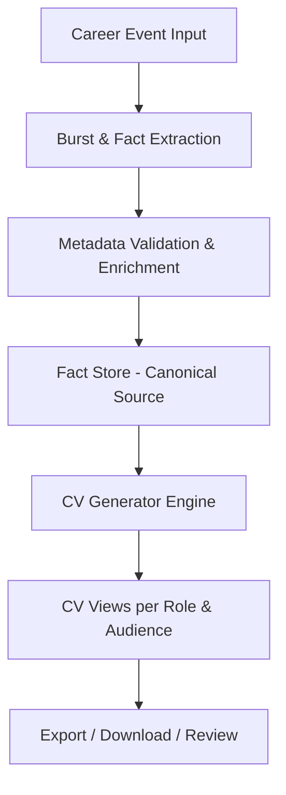
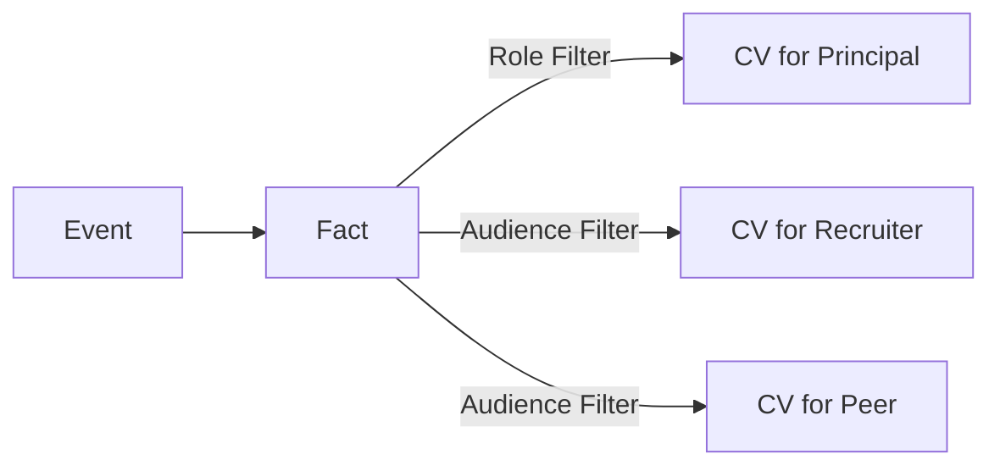
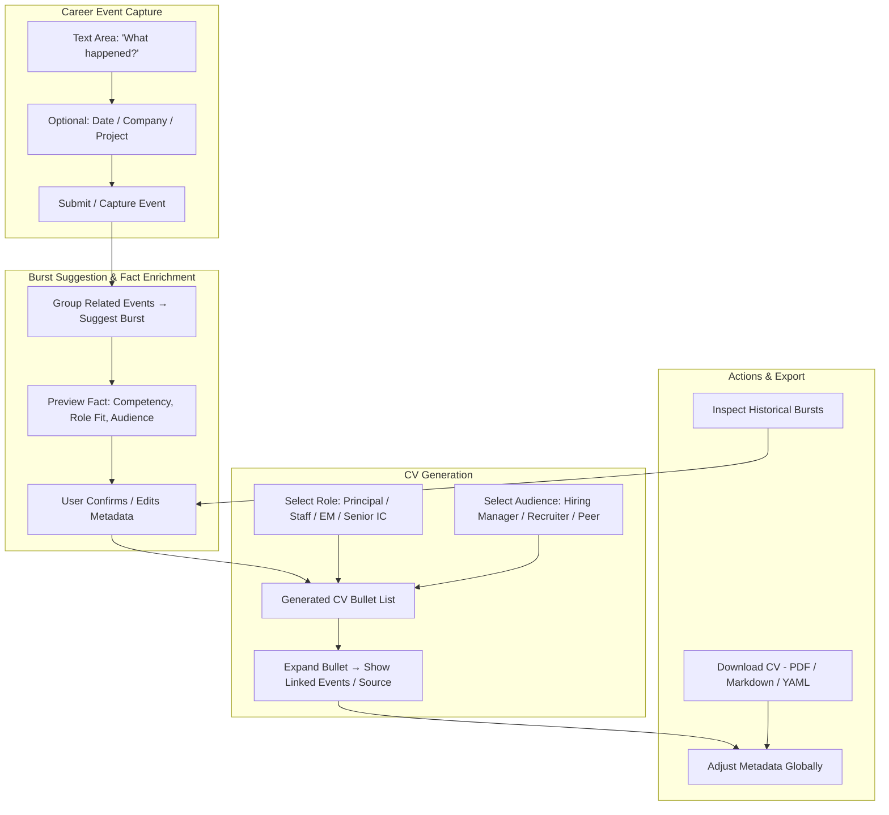
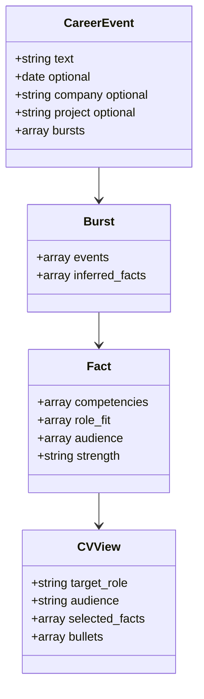
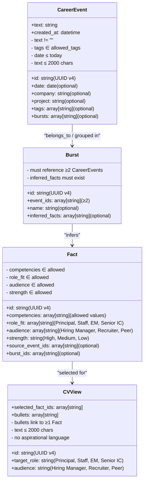
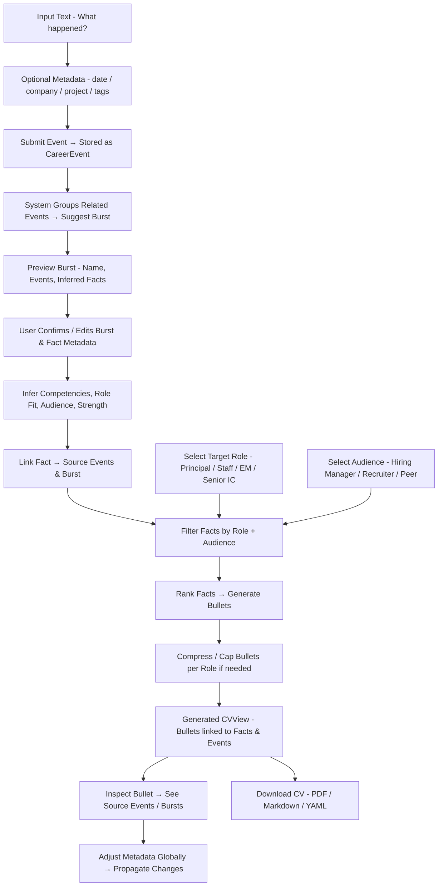

# QuikCV & KoRiyah: Content-Addressable Career Journal & CV Generator — PRD

---

## 1. Purpose

Enable senior engineers and consultants to:

- Capture career events in a low-friction, ad-hoc manner.
- Transform raw career events into credible, audience- and role-specific CV views.
- Maintain a single source of truth (“career journal”) from which multiple CV variations can be generated.
- Build trust through explainable CV generation without hallucination or role inflation.


**Stakeholders / Personas:**

- Primary users: Senior engineers, consultants
- CV audiences: Hiring managers, recruiters, peers


---

## 2. Core Concepts

### 2.1 Career Event

- Smallest input unit.
- Free-form text describing a project, outcome, or responsibility.
- Optional metadata: date, company, project.


### 2.2 Burst

- Automatically suggested grouping of related career events.
- Captures larger initiatives, projects, or phases.
- Supports CV generation and potential future portfolio/case study creation.


### 2.3 Fact

- Inferred from events.

- Contains:

    - Competencies

    - Role fit (Principal, EM, Staff)

    - Audience relevance (Hiring Manager, Recruiter, Peer)

    - Strength signal


### 2.4 CV View

- Generated dynamically based on:

    - Target role

    - Audience

    - Bullet caps per role

    - Selection rules


---

## 3. System Architecture



---

## 4. UX Principles

1. Event-centric input: **capture what happened**, not CV bullets.

2. Progressive enrichment:

    - Phase 1: raw capture

    - Phase 2: metadata clarification

    - Phase 3: system-inferred competencies / role fit

3. Two input modes:

    - Timeline journaling (default)

    - CV backfill (import existing CVs)

4. No audience/role required at input time.

5. Editing: split, merge, reclassify — **never rewrite text**.

6. CV generation: **read-only, explainable, reversible**.

7. Provide clear user feedback for invalid input (tags, dates, text length).

8. Support mobile and desktop layouts.


---

## 5. Fact Selection & CV Generation Rules

### 5.1 Inclusion / Exclusion

|Type|Rules|
|---|---|
|Inclusion|Bullet must trace to ≥1 journal entry; single-claim bullets only; prefer repeated signals.|
|Exclusion|No inferred metrics; no aspirational language; no role inflation.|

### 5.2 Ranking

- Ownership → Contribution

- Strategy → Execution

- Outcome → Activity


### 5.3 Compression

- Hard bullet caps per role (Principal: 3–4, Senior IC: 4–5)

- Older roles compress first


### 5.4 Language

- Verbs reflect actual agency

- Neutral, factual tone

- Avoid adjectives unless explicitly grounded


### 5.5 Explainability

- Every bullet must be inspectable: source events visible

- Exclusions must be visible


### 5.6 Correction

- Adjust metadata, not text

- Corrections propagate globally


### 5.7 Safety

- Conservative defaults (omit if unsure)

- No auto-publishing


---

## 6. Role & Audience Filtering

### 6.1 Role Filtering

|Role|Inclusion Criteria|Bullet Cap|
|---|---|---|
|Principal|Strategic ownership, cross-team leadership, end-to-end impact|3–4|
|Staff|Technical leadership, high-complexity implementation|4–5|
|EM|Team leadership, mentorship, delivery accountability|4–5|
|Senior IC|Deep technical contribution, system design, execution|4–5|

**Rule Details:**

- Ownership > Contribution

- Strategy > Execution

- Outcome > Activity

- Older events compress first if bullet cap exceeded


### 6.2 Audience Filtering

|Audience|Emphasis|
|---|---|
|Hiring Manager|Outcomes, ownership, business impact, leadership|
|Recruiter|Skills, competencies, high-level achievements|
|Peer|Technical depth, collaboration, problem-solving details|

**Implementation Rules:**

- All bullets remain factually traceable

- No aspirational language

- Strength signals and competencies rank relevance




---

## 7. UI Canvas — Event Capture to CV Generation



---

## 8. Data Model (Canonical Store)



---

## 9. Canonical Schema & Validation

### 9.1 CareerEvent

```yaml
CareerEvent:
  required:
    - id: string       # UUID v4
    - text: string
    - created_at: datetime
  optional:
    - date: date
    - company: string
    - project: string
    - tags: array[string]
    - bursts: array[string]
```

**Validation:**

- `text` not empty

- `tags` in allowed values

- `date` ≤ today


### 9.2 Burst

```yaml
Burst:
  required:
    - id: string
    - event_ids: array[string] # ≥2
  optional:
    - name: string
    - inferred_facts: array[string]
```

- ≥2 CareerEvents

- `inferred_facts` reference existing Facts


### 9.3 Fact

```yaml
Fact:
  required:
    - id: string
    - competencies: array[string]
    - role_fit: array[string]
    - audience: array[string]
    - strength: string
  optional:
    - source_event_ids: array[string]
    - burst_ids: array[string]
```

- `competencies` ∈ allowed values

- `role_fit` ∈ [Principal, Staff, EM, Senior IC]

- `audience` ∈ [Hiring Manager, Recruiter, Peer]

- `strength` ∈ [High, Medium, Low]


### 9.4 CVView

```yaml
CVView:
  required:
    - id: string
    - target_role: string
    - audience: string
    - selected_fact_ids: array[string]
    - bullets: array[string]
```

- `target_role` must be from allowed role values

- `audience` must be from allowed audience values

- Each bullet must link to ≥1 Fact


### 9.5 Allowed Tag Values

- **CareerEvent tags:** project, achievement, leadership, technical, consulting, research, product, mentoring

- **Fact competencies:** architecture, delivery, strategy, automation, migration, system design, performance, mentoring, cross-functional collaboration

- **Roles:** Principal, Staff, EM, Senior IC

- **Audience:** Hiring Manager, Recruiter, Peer

- **Strength:** High, Medium, Low


### 9.6 Global Validation Rules

1. All IDs must be **UUID v4**

2. References between CareerEvent → Burst → Fact → CVView must be valid (no dangling IDs)

3. Text ≤ 2000 characters per event/bullet

4. Bullets and events cannot contain aspirational language

5. No inferred numeric metrics unless explicitly sourced


---

## 9a. Canonical Schema Contract — Detailed Example & Diagrams

### Example Relationships

```yaml
CareerEvent:
  id: "e123"
  text: "Migrated platform to Ruby 3.1, improving performance."
  created_at: "2025-03-01T12:00:00Z"
  company: "Mindful Chef"
  tags: ["technical", "achievement"]
  bursts: ["b123"]

Burst:
  id: "b123"
  name: "Platform Migration to Ruby 3.1"
  event_ids: ["e123", "e124"]
  inferred_facts: ["f123"]

Fact:
  id: "f123"
  competencies: ["migration", "performance"]
  role_fit: ["Senior IC", "Staff"]
  audience: ["Hiring Manager", "Peer"]
  strength: "High"
  source_event_ids: ["e123", "e124"]
  burst_ids: ["b123"]

CVView:
  id: "cv123"
  target_role: "Senior IC"
  audience: "Hiring Manager"
  selected_fact_ids: ["f123"]
  bullets: ["Migrated platform to Ruby 3.1, improving performance and reducing server load."]
```

### Developer-Friendly Class Diagram



### Flow Diagram — Event to CV



---

## 10. Burst Examples

### 10.1 Simple Burst

```yaml
id: "b1f23c4d-9e12-4a7e-8a2c-1f5d9a2c0f23"
name: "Platform Migration to Ruby 3.1"
event_ids:
  - "e1a23f4b-1c2d-4f5e-9a1b-3c6d7e8f9a0b"
  - "e2b34c5d-2d3e-5f6a-0b1c-4d7e8f9a1b2c"
inferred_facts:
  - "f1a23b4c-5d6e-7f8a-9b0c-1d2e3f4a5b6c"
```

### 10.2 Complete Burst

```yaml
id: "b2a34d5e-6f7a-8b9c-0d1e-2f3a4b5c6d7e"
name: "End-to-End Technical Strategy for Startup"
event_ids:
  - "e3c45d6f-7a8b-9c0d-1e2f-3a4b5c6d7e8f"
  - "e4d56e7f-8b9c-0d1e-2f3a-4b5c6d7e8f9a"
  - "e5e67f8a-9c0d-1e2f-3a4b-5c6d7e8f9a0b"
inferred_facts:
  - "f2b34c5d-6e7f-8a9b-0c1d-2e3f4a5b6c7d"
  - "f3c45d6e-7f8a-9b0c-1d2e-3f4a5b6c7d8e"
```

---

## 11. Output Example — CV YAML

```yaml
CVView:
  id: "cv123"
  target_role: "Senior IC"
  audience: "Hiring Manager"
  selected_fact_ids: ["f123"]
  bullets:
    - "Migrated platform to Ruby 3.1, improving performance and reducing server load."
```

---

## 12. Acceptance Criteria / Test Cases

- Each functional requirement has testable criteria

- CV bullets must trace to ≥1 Fact

- Burst cannot save with <2 events

- Invalid tags or dates reject with feedback

- Role/audience filtered CVs respect bullet caps

- Global metadata edits propagate correctly

- No aspirational language or unlinked metrics


---

## 13. Non-Functional Requirements

- Performance: CV generation ≤ 2s for ≤500 events

- Scalability: support ≥10,000 events/user

- Security: encrypt data at rest and in transit

- Reliability: ≥99.5% availability

- Auditability: track edits, allow rollback


---

## 14. Analytics / Metrics

- Frequency of CV generation

- Most used tags/competencies

- Events not yet grouped into bursts

- Distribution of bullets by role/audience


---

## 15. Integration Considerations

- CV import from LinkedIn / resumes

- Optional integration with HR systems or ATS

- Dashboard for reporting metrics

