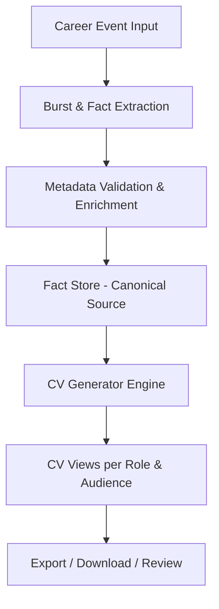
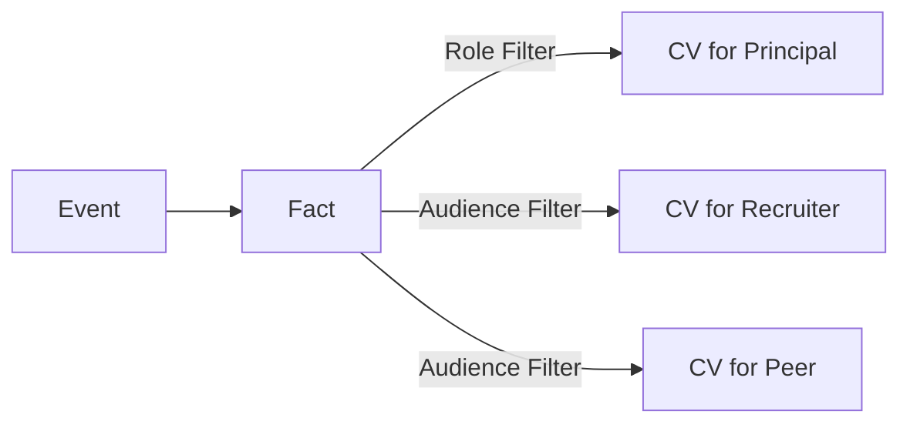
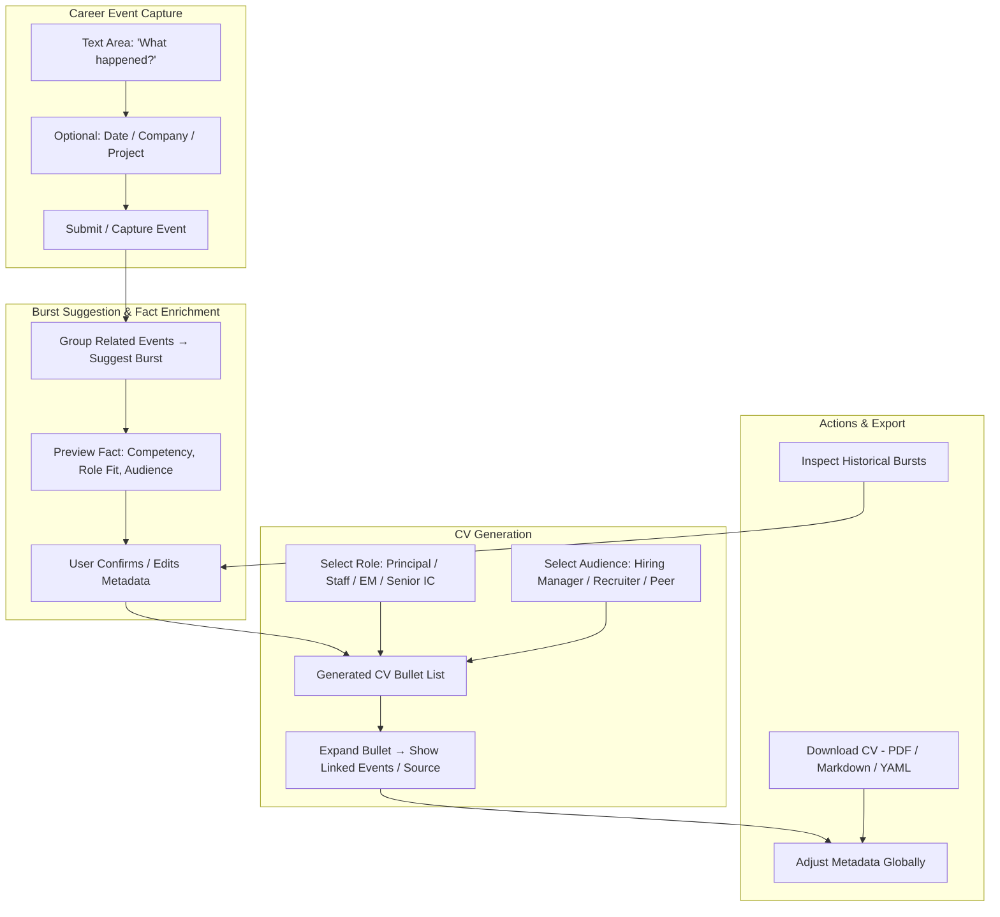
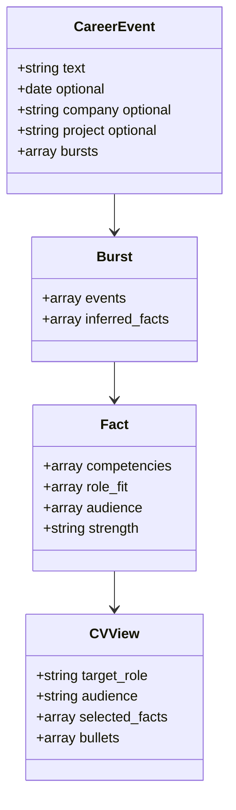
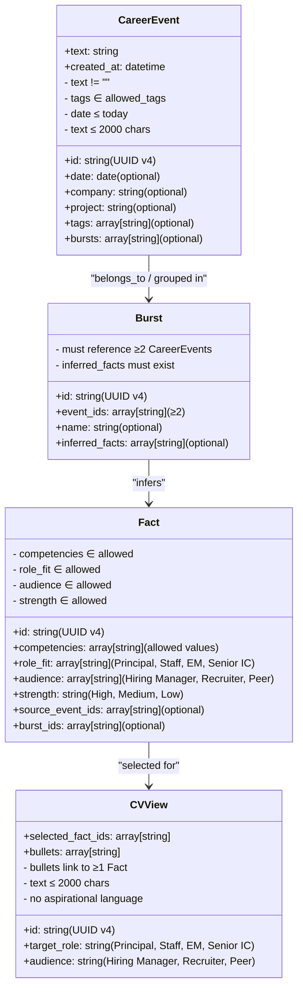
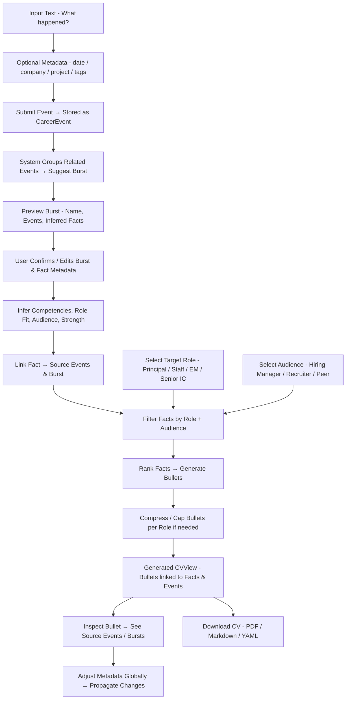

# QuikCV & KoRiyah: Content-Addressable Career Journal & CV Generator — PRD

---

## 1. Purpose

Enable senior engineers and consultants to:

- Capture career events in a low-friction, ad-hoc manner.
- Transform raw career events into credible, audience- and role-specific CV views.
- Maintain a single source of truth (“career journal”) from which multiple CV variations can be generated.
- Build trust through explainable CV generation without hallucination or role inflation.


**Stakeholders / Personas:**

- Primary users: Senior engineers, consultants
- CV audiences: Hiring managers, recruiters, peers


---

## 2. Core Concepts

### 2.1 Career Event

- Smallest input unit.
- Free-form text describing a project, outcome, or responsibility.
- Optional metadata: date, company, project.


### 2.2 Burst

- Automatically suggested grouping of related career events.
- Captures larger initiatives, projects, or phases.
- Supports CV generation and potential future portfolio/case study creation.


### 2.3 Fact

- Inferred from events.

- Contains:

    - Competencies

    - Role fit (Principal, EM, Staff)

    - Audience relevance (Hiring Manager, Recruiter, Peer)

    - Strength signal


### 2.4 CV View

- Generated dynamically based on:

    - Target role

    - Audience

    - Bullet caps per role

    - Selection rules


---

## 3. System Architecture



---

## 4. UX Principles

1. Event-centric input: **capture what happened**, not CV bullets.

2. Progressive enrichment:

    - Phase 1: raw capture

    - Phase 2: metadata clarification

    - Phase 3: system-inferred competencies / role fit

3. Two input modes:

    - Timeline journaling (default)

    - CV backfill (import existing CVs)

4. No audience/role required at input time.

5. Editing: split, merge, reclassify — **never rewrite text**.

6. CV generation: **read-only, explainable, reversible**.

7. Provide clear user feedback for invalid input (tags, dates, text length).

8. Support mobile and desktop layouts.


---

## 5. Fact Selection & CV Generation Rules

### 5.1 Inclusion / Exclusion

|Type|Rules|
|---|---|
|Inclusion|Bullet must trace to ≥1 journal entry; single-claim bullets only; prefer repeated signals.|
|Exclusion|No inferred metrics; no aspirational language; no role inflation.|

### 5.2 Ranking

- Ownership → Contribution

- Strategy → Execution

- Outcome → Activity


### 5.3 Compression

- Hard bullet caps per role (Principal: 3–4, Senior IC: 4–5)

- Older roles compress first


### 5.4 Language

- Verbs reflect actual agency

- Neutral, factual tone

- Avoid adjectives unless explicitly grounded


### 5.5 Explainability

- Every bullet must be inspectable: source events visible

- Exclusions must be visible


### 5.6 Correction

- Adjust metadata, not text

- Corrections propagate globally


### 5.7 Safety

- Conservative defaults (omit if unsure)

- No auto-publishing


---

## 6. Role & Audience Filtering

### 6.1 Role Filtering

|Role|Inclusion Criteria|Bullet Cap|
|---|---|---|
|Principal|Strategic ownership, cross-team leadership, end-to-end impact|3–4|
|Staff|Technical leadership, high-complexity implementation|4–5|
|EM|Team leadership, mentorship, delivery accountability|4–5|
|Senior IC|Deep technical contribution, system design, execution|4–5|

**Rule Details:**

- Ownership > Contribution

- Strategy > Execution

- Outcome > Activity

- Older events compress first if bullet cap exceeded


### 6.2 Audience Filtering

|Audience|Emphasis|
|---|---|
|Hiring Manager|Outcomes, ownership, business impact, leadership|
|Recruiter|Skills, competencies, high-level achievements|
|Peer|Technical depth, collaboration, problem-solving details|

**Implementation Rules:**

- All bullets remain factually traceable

- No aspirational language

- Strength signals and competencies rank relevance




---

## 7. UI Canvas — Event Capture to CV Generation



---

## 8. Data Model (Canonical Store)



---

## 9. Canonical Schema & Validation

### 9.1 CareerEvent

```yaml
CareerEvent:
  required:
    - id: string       # UUID v4
    - text: string
    - created_at: datetime
  optional:
    - date: date
    - company: string
    - project: string
    - tags: array[string]
    - bursts: array[string]
```

**Validation:**

- `text` not empty

- `tags` in allowed values

- `date` ≤ today


### 9.2 Burst

```yaml
Burst:
  required:
    - id: string
    - event_ids: array[string] # ≥2
  optional:
    - name: string
    - inferred_facts: array[string]
```

- ≥2 CareerEvents

- `inferred_facts` reference existing Facts


### 9.3 Fact

```yaml
Fact:
  required:
    - id: string
    - competencies: array[string]
    - role_fit: array[string]
    - audience: array[string]
    - strength: string
  optional:
    - source_event_ids: array[string]
    - burst_ids: array[string]
```

- `competencies` ∈ allowed values

- `role_fit` ∈ [Principal, Staff, EM, Senior IC]

- `audience` ∈ [Hiring Manager, Recruiter, Peer]

- `strength` ∈ [High, Medium, Low]


### 9.4 CVView

```yaml
CVView:
  required:
    - id: string
    - target_role: string
    - audience: string
    - selected_fact_ids: array[string]
    - bullets: array[string]
```

- `target_role` must be from allowed role values

- `audience` must be from allowed audience values

- Each bullet must link to ≥1 Fact


### 9.5 Allowed Tag Values

- **CareerEvent tags:** project, achievement, leadership, technical, consulting, research, product, mentoring

- **Fact competencies:** architecture, delivery, strategy, automation, migration, system design, performance, mentoring, cross-functional collaboration

- **Roles:** Principal, Staff, EM, Senior IC

- **Audience:** Hiring Manager, Recruiter, Peer

- **Strength:** High, Medium, Low


### 9.6 Global Validation Rules

1. All IDs must be **UUID v4**

2. References between CareerEvent → Burst → Fact → CVView must be valid (no dangling IDs)

3. Text ≤ 2000 characters per event/bullet

4. Bullets and events cannot contain aspirational language

5. No inferred numeric metrics unless explicitly sourced


---

## 9a. Canonical Schema Contract — Detailed Example & Diagrams

### Example Relationships

```yaml
CareerEvent:
  id: "e123"
  text: "Migrated platform to Ruby 3.1, improving performance."
  created_at: "2025-03-01T12:00:00Z"
  company: "Mindful Chef"
  tags: ["technical", "achievement"]
  bursts: ["b123"]

Burst:
  id: "b123"
  name: "Platform Migration to Ruby 3.1"
  event_ids: ["e123", "e124"]
  inferred_facts: ["f123"]

Fact:
  id: "f123"
  competencies: ["migration", "performance"]
  role_fit: ["Senior IC", "Staff"]
  audience: ["Hiring Manager", "Peer"]
  strength: "High"
  source_event_ids: ["e123", "e124"]
  burst_ids: ["b123"]

CVView:
  id: "cv123"
  target_role: "Senior IC"
  audience: "Hiring Manager"
  selected_fact_ids: ["f123"]
  bullets: ["Migrated platform to Ruby 3.1, improving performance and reducing server load."]
```

### Developer-Friendly Class Diagram



### Flow Diagram — Event to CV



---

## 10. Burst Examples

### 10.1 Simple Burst

```yaml
id: "b1f23c4d-9e12-4a7e-8a2c-1f5d9a2c0f23"
name: "Platform Migration to Ruby 3.1"
event_ids:
  - "e1a23f4b-1c2d-4f5e-9a1b-3c6d7e8f9a0b"
  - "e2b34c5d-2d3e-5f6a-0b1c-4d7e8f9a1b2c"
inferred_facts:
  - "f1a23b4c-5d6e-7f8a-9b0c-1d2e3f4a5b6c"
```

### 10.2 Complete Burst

```yaml
id: "b2a34d5e-6f7a-8b9c-0d1e-2f3a4b5c6d7e"
name: "End-to-End Technical Strategy for Startup"
event_ids:
  - "e3c45d6f-7a8b-9c0d-1e2f-3a4b5c6d7e8f"
  - "e4d56e7f-8b9c-0d1e-2f3a-4b5c6d7e8f9a"
  - "e5e67f8a-9c0d-1e2f-3a4b-5c6d7e8f9a0b"
inferred_facts:
  - "f2b34c5d-6e7f-8a9b-0c1d-2e3f4a5b6c7d"
  - "f3c45d6e-7f8a-9b0c-1d2e-3f4a5b6c7d8e"
```

---

## 11. Output Example — CV YAML

```yaml
CVView:
  id: "cv123"
  target_role: "Senior IC"
  audience: "Hiring Manager"
  selected_fact_ids: ["f123"]
  bullets:
    - "Migrated platform to Ruby 3.1, improving performance and reducing server load."
```

---

## 12. Acceptance Criteria / Test Cases

- Each functional requirement has testable criteria

- CV bullets must trace to ≥1 Fact

- Burst cannot save with <2 events

- Invalid tags or dates reject with feedback

- Role/audience filtered CVs respect bullet caps

- Global metadata edits propagate correctly

- No aspirational language or unlinked metrics


---

## 13. Non-Functional Requirements

- Performance: CV generation ≤ 2s for ≤500 events

- Scalability: support ≥10,000 events/user

- Security: encrypt data at rest and in transit

- Reliability: ≥99.5% availability

- Auditability: track edits, allow rollback


---

## 14. Analytics / Metrics

- Frequency of CV generation

- Most used tags/competencies

- Events not yet grouped into bursts

- Distribution of bullets by role/audience


---

## 15. Integration Considerations

- CV import from LinkedIn / resumes

- Optional integration with HR systems or ATS

- Dashboard for reporting metrics


---

## 16. User Journeys

This section documents the primary user journeys through KaRiya, from first use to CV generation.

---

### 16.1 Primary Journey: Career Data to Professional CV

The core value proposition of KaRiya is transforming raw career data into audience-specific, professional CVs. This journey has three simplified phases:

```
┌──────────────────────────────────────────────────────────────────────────┐
│                     PHASE 1: ONBOARDING / IMPORT                         │
│                                                                          │
│  User starts with existing career data or fresh start:                   │
│                                                                          │
│  ┌─────────────┐     ┌─────────────┐     ┌─────────────┐                │
│  │ Import CSV  │ OR  │ Start Fresh │ OR  │ Quick Entry │                │
│  │ (existing   │     │ (new user,  │     │ (capture    │                │
│  │  data)      │     │  empty)     │     │  one event) │                │
│  └──────┬──────┘     └──────┬──────┘     └──────┬──────┘                │
│         └──────────────────┬┴────────────────────┘                       │
│                            ▼                                             │
│                    Events in Timeline                                    │
└──────────────────────────────────────────────────────────────────────────┘
                              │
                              ▼
┌──────────────────────────────────────────────────────────────────────────┐
│                     PHASE 2: CAPTURE & ENRICH                            │
│                                                                          │
│  User iteratively adds and enriches career data:                         │
│                                                                          │
│  ┌─────────────┐     ┌─────────────┐     ┌─────────────┐                │
│  │ Add Event   │ ──▶ │ Add Skills  │ ──▶ │ Burst       │                │
│  │ (describe   │     │ (tech used) │     │ Suggestion  │                │
│  │  what       │     │             │     │ (group      │                │
│  │  happened)  │     │             │     │  related)   │                │
│  └─────────────┘     └─────────────┘     └─────────────┘                │
│         │                   │                   │                        │
│         │                   │                   ▼                        │
│         │                   │            ┌─────────────┐                 │
│         │                   └──────────▶ │ Fact        │                 │
│         │                                │ Extraction  │                 │
│         │                                │ (competency,│                 │
│         │                                │  role fit)  │                 │
│         │                                └─────────────┘                 │
│         │                                       │                        │
│         └───────────── Iterate ─────────────────┘                        │
│                                                                          │
│  Key Enhancements:                                                       │
│  • Date, Company, Project metadata                                       │
│  • Skills automatically tracked and suggested                            │
│  • Related events grouped into Bursts                                    │
│  • Competencies and role fit extracted as Facts                          │
└──────────────────────────────────────────────────────────────────────────┘
                              │
                              ▼
┌──────────────────────────────────────────────────────────────────────────┐
│                     PHASE 3: GENERATE CV                                 │
│                                                                          │
│  User generates audience-specific CVs:                                   │
│                                                                          │
│  ┌─────────────┐     ┌─────────────┐     ┌─────────────┐                │
│  │ Select      │ ──▶ │ Select      │ ──▶ │ Select      │                │
│  │ Profile     │     │ Audience    │     │ Variant     │                │
│  │ (Principal, │     │ (Hiring Mgr,│     │ (Length +   │                │
│  │  Staff...)  │     │  Recruiter) │     │  Emphasis)  │                │
│  └─────────────┘     └─────────────┘     └─────────────┘                │
│         │                                        │                       │
│         └────────────────┬───────────────────────┘                       │
│                          ▼                                               │
│  ┌─────────────┐     ┌─────────────┐     ┌─────────────┐                │
│  │ Generate CV │ ──▶ │ Preview &   │ ──▶ │ Export      │                │
│  │ (auto-      │     │ Review      │     │ (Markdown,  │                │
│  │  bullets)   │     │             │     │  Text, YAML)│                │
│  └─────────────┘     └─────────────┘     └─────────────┘                │
└──────────────────────────────────────────────────────────────────────────┘
```

---

### 16.2 How Skills Integrate

Skills are central to career data enrichment and CV generation:

#### During Event Capture (Phase 2)

```
┌─────────────────────────────────────────────────────────────────────┐
│                     Capture Event Form                              │
│                                                                     │
│  What happened?                                                     │
│  ┌─────────────────────────────────────────────────────────────┐   │
│  │ Led migration from Ruby 2.7 to 3.1, improving performance  │   │
│  └─────────────────────────────────────────────────────────────┘   │
│                                                                     │
│  Date: 2024-03-15    Company: Acme Corp    Project: Platform       │
│                                                                     │
│  Skills used: (Select or type to create new)                       │
│  ┌─────────────────────────────────────────────────────────────┐   │
│  │ ☑ Ruby           ☑ Rails         ☑ Docker                  │   │
│  │ ☐ Go             ☐ Kubernetes    + Add new skill...         │   │
│  └─────────────────────────────────────────────────────────────┘   │
│                                                                     │
│  [Submit]  [Cancel]                                                │
└─────────────────────────────────────────────────────────────────────┘
```

**What Happens**:
1. User selects existing skills or creates new ones
2. Skills are associated with the event (`event_skills` junction table)
3. If new skill created:
   - Name and category captured
   - Optional: Level (beginner/intermediate/advanced/expert)
   - Optional: Years of experience
4. Skills influence fact extraction (competencies derived from skills)

#### Skills Management (Anytime)

Users can manage their skill catalog:

```
┌─────────────────────────────────────────────────────────────────────┐
│                     Manage Skills                                   │
│                                                                     │
│  Backend (12 skills)                                                │
│  ▶ Ruby (15 events, last used: 2024-03-15)          [Edit][Delete] │
│    Go (8 events, last used: 2024-01-10)             [Edit][Delete] │
│    Python (3 events, last used: 2023-09-20)         [Edit][Delete] │
│                                                                     │
│  Frontend (5 skills)                                                │
│    React (7 events, last used: 2024-02-14)          [Edit][Delete] │
│    TypeScript (7 events, last used: 2024-02-14)     [Edit][Delete] │
│                                                                     │
│  DevOps (8 skills)                                                  │
│    Kubernetes (10 events, last used: 2024-03-10)    [Edit][Delete] │
│                                                                     │
│  [n] New   [f] Filter   [s] Sort   [Esc] Back                      │
└─────────────────────────────────────────────────────────────────────┘
```

**Skills are used for**:
- Tracking technology experience across events
- Generating technical skills sections in CVs
- Filtering events by technology
- Demonstrating breadth and depth of expertise

---

### 16.3 CV Variant Example: "Short All Experience"

One of the most useful CV variants combines **short length** with **comprehensive history**:

**Variant**: `senior_backend_short`

**Configuration**:
- **Role Emphasis**: Senior Backend
- **Length Format**: Short (1-2 pages, 5 years max history by default)
- **BUT**: User can override to "all experience" if needed

**Example Workflow**:

```
1. Select Profile: "Senior Backend Engineer"
2. Select Audience: "Hiring Manager"
3. Select Role Emphasis: "Senior Backend"
4. Select Length Format: "Short"
   
   ┌─────────────────────────────────────────────────────────────┐
   │ Short CV (1-2 pages)                                        │
   │                                                             │
   │ ☑ Last 5 years only                                         │
   │ ☐ All experience (override)                                 │
   │                                                             │
   │ Max bullets per role: 4-5                                   │
   │ Confidence threshold: 0.75 (high confidence only)           │
   │                                                             │
   │ [Generate]  [Back]                                          │
   └─────────────────────────────────────────────────────────────┘
```

**Generated CV Structure**:

```
Senior Backend Engineer

EXPERIENCE

Acme Corp - Senior Backend Engineer (2022-Present)
• Led Ruby 3.1 migration improving performance by 40%
• Architected microservices platform serving 10M+ requests/day
• Mentored 5 engineers on Rails best practices
• Implemented CI/CD pipeline reducing deployment time by 70%

TechCo - Backend Engineer (2019-2022)
• Built REST API handling 5M+ daily transactions
• Optimized database queries reducing latency by 60%
• Introduced Docker containerization across team

[If "All experience" override selected, continues with earlier roles]

StartupX - Software Engineer (2016-2019)
• Developed core platform features in Ruby on Rails
• Maintained 99.9% uptime for production services

SKILLS

Languages: Ruby, Go, Python, SQL
Frameworks: Rails, Sinatra, Fiber
Infrastructure: Docker, Kubernetes, AWS
Databases: PostgreSQL, Redis, Elasticsearch
```

**Key Features**:
- **Configurable history**: Default 5 years, override to show all
- **High confidence bullets**: Only strongest achievements (0.75+ confidence)
- **Skills section**: Auto-generated from skill associations
- **Concise format**: Perfect for initial screens or recruiter reviews

---

### 16.4 User Journey Workflows

#### Journey 1: New User with Existing CV

**Goal**: Import existing career history and generate updated CV

**Steps**:
1. **Import** → Select CSV file with career events
2. **Preview** → Review parsed events, fix mapping issues
3. **Confirm** → Import events into timeline
4. **Enrich Skills** → Go through events, add skill associations
5. **Generate** → Select profile/audience/variant, generate CV
6. **Export** → Download as Markdown or Text

**Duration**: 45-90 minutes for first CV (includes skill setup)

#### Journey 2: Regular User Adding New Experience

**Goal**: Capture recent project and update CV

**Steps**:
1. **Capture** → Describe what happened
2. **Add Skills** → Select technologies used (or create new)
3. **Metadata** → Confirm date, company, project
4. **Review** → Accept/reject burst suggestion
5. **Generate** → Regenerate CV with new content

**Duration**: 5-10 minutes per event

#### Journey 3: Job Application Preparation

**Goal**: Generate tailored CV for specific opportunity

**Steps**:
1. **Review Skills** → Ensure relevant skills are in catalog
2. **Configure** → Select role profile matching job
3. **Audience** → Select Hiring Manager for senior roles
4. **Variant** → Choose "Short All Experience" for comprehensive 1-pager
5. **Preview** → Review generated bullets
6. **Export** → Download in required format

**Duration**: 10-15 minutes per application

---

### 16.5 Navigation Patterns

All KaRiya workflows follow consistent navigation:

| Key | Action | Context |
|-----|--------|---------|
| `Esc` | Go back / Cancel | Works everywhere |
| `m` | Return to main menu | From any screen |
| `q` / `Ctrl+C` | Quit application | From any screen |
| `?` | Show help | From any screen |
| `↑/k` | Move up | Lists, menus |
| `↓/j` | Move down | Lists, menus |
| `Enter` | Select / Submit | Lists, forms |
| `Tab` | Next field | Forms |
| `g/G` | Top / Bottom | Lists |

---

### 16.6 Error Recovery

KaRiya provides graceful error recovery throughout:

| Scenario | Behavior |
|----------|----------|
| Form validation error | Field highlighted, error message shown |
| Save failure | Error modal, data preserved, retry available |
| Import parse error | Shows problematic rows, allows skip or fix |
| CV generation failure | Error modal, can adjust filters and retry |
| Network timeout | Graceful fallback to local data |

All errors preserve user work - no data loss on failure.

