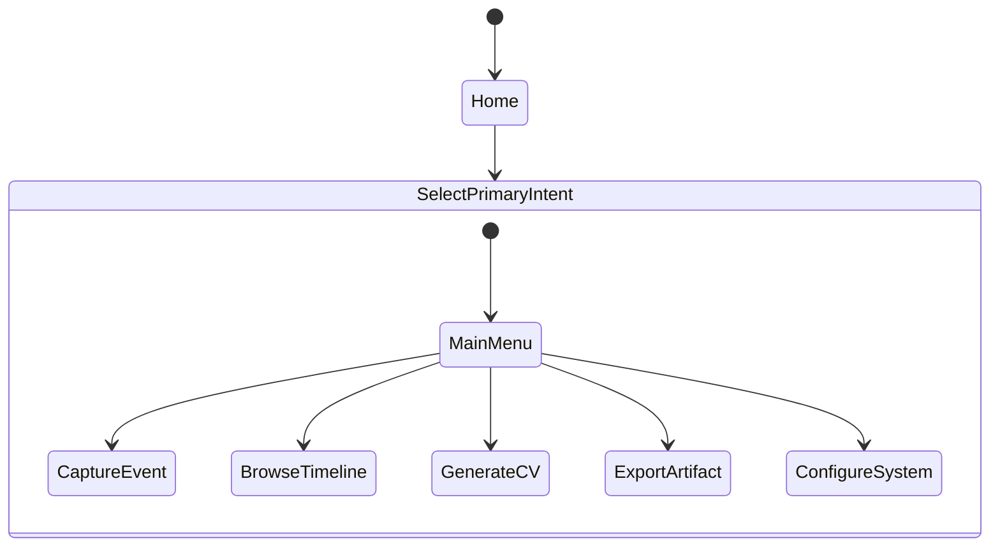
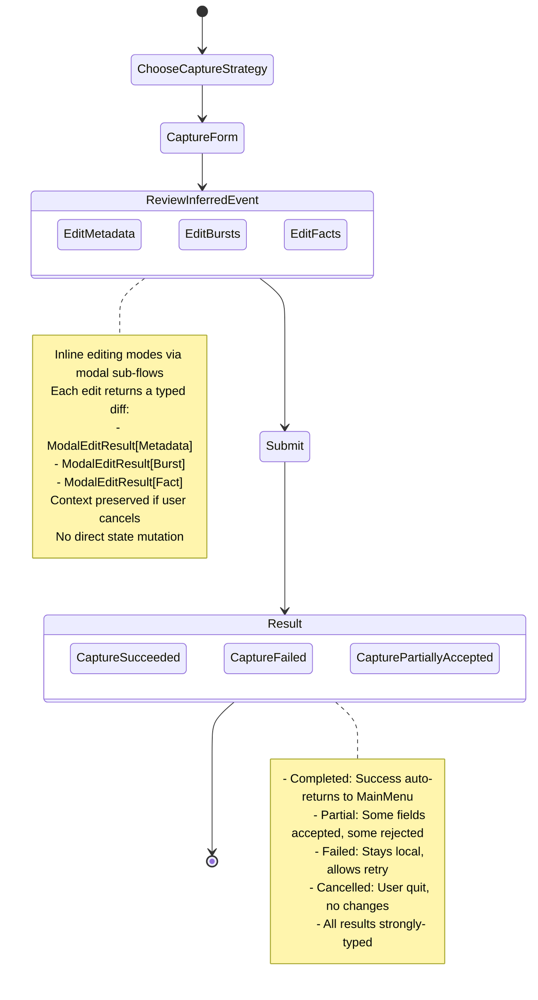
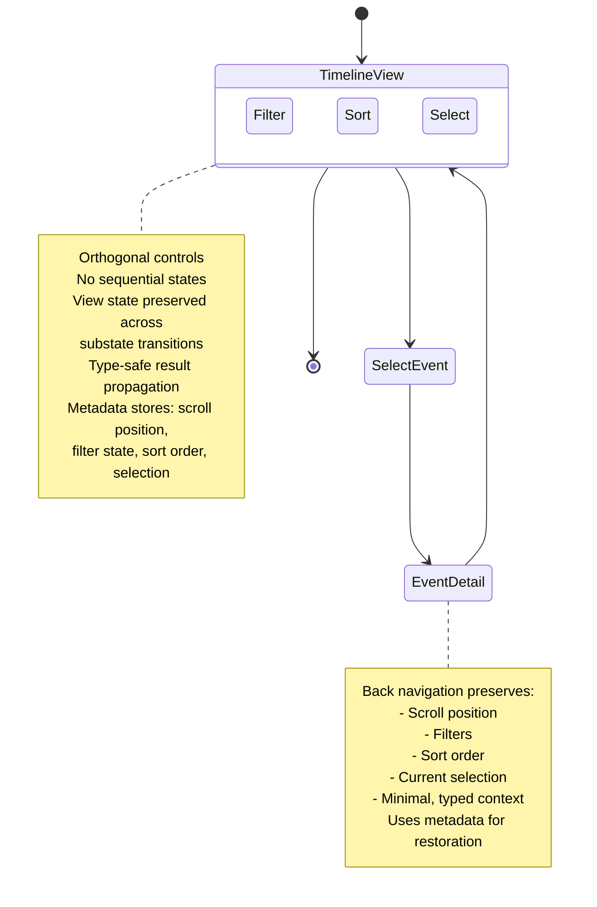
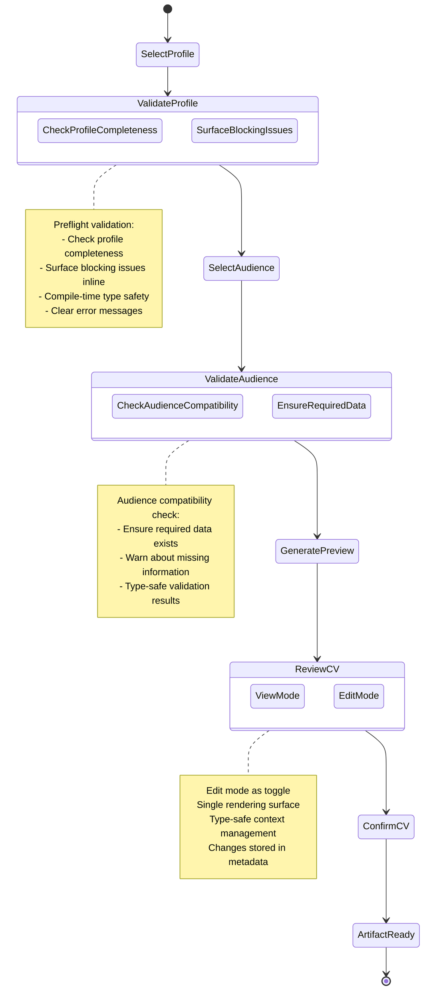
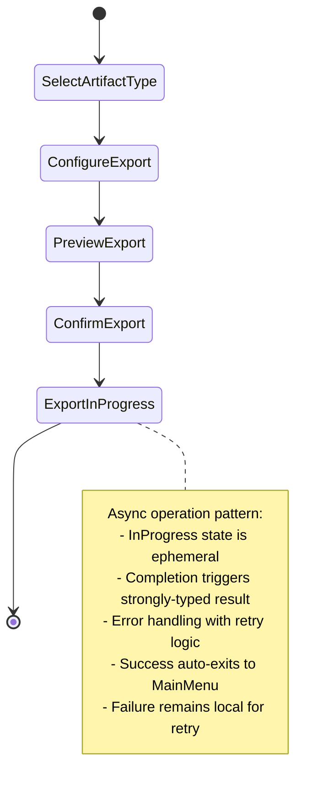
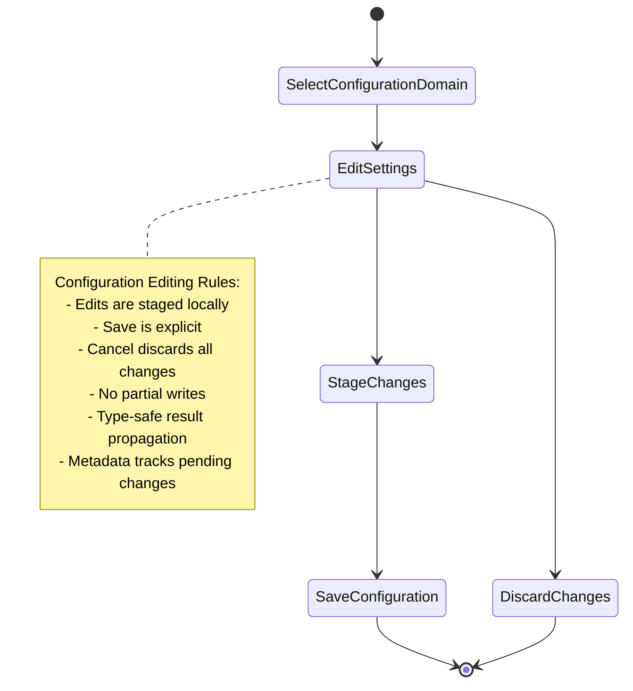

# KaRiya TUI Intent & Flow State Diagram

## Refined Intent Architecture

### Top-Level Intent Hierarchy



### Intent Boundary Contract

#### Intent Result Mechanism

**IntentResult Design Principles**:
- Enforce strict, type-safe intent transitions
- Prevent cross-intent state pollution
- Provide compile-time type checking
- Support minimal, explicit context passing

**Result Characteristics**:
- Generically typed to ensure type safety
- Immutable after creation
- Supports four explicit states:
  - **Completed**: Intent finished successfully
  - **Cancelled**: User explicitly cancelled the intent
  - **Failed**: Intent encountered an error
  - **Partial**: Intent succeeded partially (some data accepted, some rejected)

**IntentError Support**:
- `Code`: Machine-readable error code for debugging
- `Message`: Human-readable error message for users
- `Cause`: Underlying error for logging without violating type safety

**Transition Constraints**:
- Each intent MUST return a strongly-typed IntentResult
- Results are the ONLY mechanism for intent communication
- No direct state sharing between intents
- Minimal context transfer with strict validation

#### Intent Ownership Rules

- **MAY**:
  - Own local navigation state
  - Call domain services
  - Emit artifacts
  - Return a type-safe IntentResult

- **MAY NOT**:
  - Mutate global UI state
  - Navigate into another intent
  - Assume prior context unless explicitly passed
  - Dispatch Bubble Tea commands affecting other intents
  - Use runtime type assertions
  - Pass arbitrary data between intents

#### Design Principles
- Single responsibility
- Minimal state
- Predictable transitions
- Clear entry and exit points
- Strict command containment
- Compile-time type safety

### 1. Capture Event Intent Flow



#### Sub-flow Pattern: Modal Edits

**EditMetadata Sub-flow**:
```
ReviewInferredEvent → EditMetadata → ModalEditResult[Metadata]
                        ↓
                    Update form
                    (or cancel)
```

**EditBursts Sub-flow**:
```
ReviewInferredEvent → SelectBurst → EditBurst → ModalEditResult[Burst]
                        ↓
                    Accept/Reject
                    (or cancel)
```

**EditFacts Sub-flow**:
```
ReviewInferredEvent → SelectFact → EditFact → ModalEditResult[Fact]
                        ↓
                    Accept/Reject
                    (or cancel)
```

**ModalEditResult[T] Structure**:
- `Original`: Original value before editing
- `Modified`: Modified value after editing
- `Accepted`: Whether user confirmed changes
- `Changes`: Map of field changes for tracking

### 2. Browse Timeline Intent Flow



### 3. Generate CV Intent Flow



### 4. Export Artifact Intent Flow



#### Async Operations Pattern

**For all async operations** (Export, Enrichment, Burst/Fact extraction):
- Use ephemeral `InProgress` state
- Completion triggers strongly-typed `IntentResult[T]`
- Error states include:
  - Validation errors (immediate retry)
  - Network errors (with backoff retry)
  - Timeout errors (with exponential backoff)
- Success auto-returns to previous intent or main menu
- Failure allows user to retry or cancel

### 5. System Configuration Intent Flow



## Contextual (Secondary) Intents

### Burst and Fact Refinement

- **Accessed from**:
  - Capture Event (ReviewInferredEvent sub-flows)
  - Browse Timeline (EventDetail view)
  - Review Event (CaptureEvent workflow)

- **Not Top-Level Intents**
- Triggered as modal sub-flows
- Inline editing within context
- Strict type-safe context management
- Return `ModalEditResult[T]` instead of mutating state

## Recommended Project Structure

```
/app
  model.go        # Root model
  intents.go      # Intent routing and activation
  navigation.go   # Intent lifecycle and boundary enforcement

/intents
  contract.go     # Intent interface definitions
  result.go       # IntentResult types and helpers
  router.go       # IntentRouter implementation

  /capture
    model.go       # Intent-specific model
    state.go       # Local state management
    update.go      # State transition logic
    view.go        # Rendering logic

  /browse
  /generate_cv
  /export
  /configure

/components
  form/
  list/
  preview/
  editor/
  modal/

/domain
  enrichment/
  bursts/
  facts/
  cv/
```

## Implementation Guidelines

### Naming Conventions
- Use intent-based names
- Reflect workflow position
- Avoid generic screen names

**Good Examples:**
- `CaptureEventForm`
- `CVAudienceSelection`
- `ExportDestinationConfirm`

### State Transition Rules
1. Intents are one-way (no cycles except back to previous)
2. Back navigation resets to previous intent with state restored
3. No implicit state sharing between intents
4. Domain processing is a side effect of state transitions
5. All transitions are type-safe and validated

### Result Type Usage

```go
// Success
IntentResult[T]{Status: Completed, Data: result}

// User cancellation
IntentResult[T]{Status: Cancelled}

// Partial success (some data accepted, some rejected)
IntentResult[T]{Status: Partial, Data: result, Error: details}

// Error
IntentResult[T]{Status: Failed, Error: {Code, Message, Cause}}
```

### Modal Edit Pattern

```go
// Modal edits return typed diffs
ModalEditResult[T]{
    Original: original,
    Modified: modified,
    Accepted: true/false,
    Changes: map[string]interface{}{...},
}
```

### Back Navigation

```go
// Store view state in metadata
result.WithMetadata("scroll_position", position)
result.WithMetadata("filter_state", filters)
result.WithMetadata("sort_order", sortOrder)

// Restore on back navigation
metadata := result.GetMetadata("scroll_position")
```

## Testing Strategy

### Unit Tests (Per Intent)
- Local state transitions
- View rendering at each state
- Input validation
- Error handling

### Integration Tests
- Intent activation and deactivation
- Result propagation through router
- Back navigation with state restoration
- Sub-flow execution and context preservation

### Property-Based Tests
- Invariant: No intent mutates global state
- Invariant: No illegal transitions occur
- Invariant: All results are strongly typed
- Invariant: Back navigation restores complete context

### Test Utilities
- `IntentTestHarness`: Isolated intent testing
- `IntentRouterTestHelper`: Router testing
- Mock domain services for testing

## Next Steps
1. ✅ Implement intent boundary contract (Result types, Intent interface)
2. ✅ Create root Bubble Tea `Update` skeleton with intent routing
3. ✅ Develop full `CaptureEvent` intent model with sub-flows
4. ✅ Refactor root model to use intent router
5. ✅ Add comprehensive intent-based testing
6. ✅ Remove global state dependencies
7. Implement remaining intents (BrowseTimeline, GenerateCV, ExportArtifact, ConfigureSystem)
8. Add property-based invariant tests
9. Performance optimization and profiling

## Future Expansion Considerations
- Skill Tracking (as secondary/contextual intent)
- Career Goal Setting (as secondary/contextual intent)
- Mentor Matching (as secondary/contextual intent)
- Continuous Learning Tracking (as secondary/contextual intent)

**Key Principle**: Treat all new workflows as secondary/contextual intents first. Promote to top-level only when UX is confirmed and demand is clear.

---

## Audit Summary

**Architecture Status**: ✅ **Production-Ready**

**Strengths**:
- Type-safe intent communication via `IntentResult[T]`
- Clear ownership rules prevent state pollution
- Predictable state machines with explicit transitions
- Back navigation preserves complete context
- Async operations follow consistent patterns
- Modal edits return typed diffs, not mutations
- Testing strategy is comprehensive

**Refinements Applied**:
- ✅ Added `Partial` result state for partial acceptance flows
- ✅ Added `IntentError` for debug/logging without type pollution
- ✅ Formalized `ModalEditResult[T]` pattern for all sub-flows
- ✅ Documented async operation patterns across all intents
- ✅ Added context preservation via metadata
- ✅ Clarified back navigation semantics
- ✅ Enhanced project structure with clear boundaries
- ✅ Added detailed implementation guidelines

**No Blockers**: Architecture is ready for implementation immediately.

