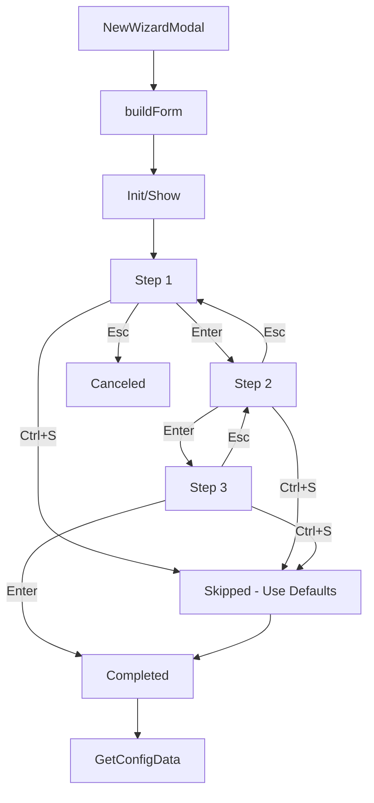

# Wizard Modal Development Guide

**Complete Guide to Building Multi-Step Wizard Modals in KaRiya**

**Last Updated**: 2026-01-14  
**Audience**: Developers implementing wizard workflows  
**Reference Implementation**: `CVConfigWizardModal` (Task 43)

---

## Table of Contents

1. [Overview](#overview)
2. [When to Use Wizard Modals](#when-to-use-wizard-modals)
3. [Architecture](#architecture)
4. [Implementation Guide](#implementation-guide)
5. [Best Practices](#best-practices)
6. [Testing](#testing)
7. [Troubleshooting](#troubleshooting)
8. [Reference Implementation](#reference-implementation)

---

## Overview

### What is a Wizard Modal?

A wizard modal is a multi-step form experience that guides users through a complex configuration or data collection process. Each step (or "page") focuses on a specific aspect of the configuration, with clear navigation between steps.

**Key Characteristics**:
- **Sequential**: Users progress through steps in order
- **Focused**: Each step addresses one configuration aspect
- **Guided**: Clear instructions and validation per step
- **Skippable**: Option to use defaults (Ctrl+S)
- **Reversible**: Users can navigate backward

### Benefits Over Multi-Screen Flows

| Aspect | Multi-Screen | Wizard Modal | Winner |
|--------|--------------|--------------|--------|
| Context switches | High (each screen is separate) | Low (single modal) | ✅ Wizard |
| State management | Complex (across screens) | Simple (single component) | ✅ Wizard |
| User experience | Fragmented | Cohesive | ✅ Wizard |
| Code complexity | High (multiple screens) | Medium (single modal) | ✅ Wizard |
| Lines of code | 1000+ (intent + screens) | 300-500 (modal) | ✅ Wizard |

---

## When to Use Wizard Modals

### Good Use Cases

✅ **Configuration workflows** with multiple related settings  
✅ **Data collection** requiring 3-7 steps  
✅ **Guided experiences** where users need direction  
✅ **Complex forms** that benefit from logical grouping  
✅ **Optional features** where defaults make sense

**Examples**:
- CV generation configuration (WHO → TECH → FORMAT)
- Project setup wizards
- Import configuration
- Profile creation

### When NOT to Use Wizard Modals

❌ **Single-step processes** - Use regular modal or form  
❌ **Non-sequential workflows** - Users need to jump between steps freely  
❌ **Large data entry** - Better suited for dedicated screens  
❌ **Real-time preview** - Needs continuous visibility of results

---

## Architecture

### Component Structure

```go
type YourWizardModal struct {
    form           *huh.Form      // Huh form with groups per step
    data           *YourConfigData // Collected data
    currentStep    int             // Current step index (0-based)
    visible        bool            // Modal visibility
    completed      bool            // Wizard completed flag
    skipped        bool            // Wizard skipped flag
    width          int             // Terminal width
    height         int             // Terminal height
    
    // Optional: Dynamic step configuration
    stepsEnabled   []bool          // Which steps are active
}

type YourConfigData struct {
    // Group fields by step for clarity
    
    // Step 1 fields
    Field1 string
    Field2 string
    
    // Step 2 fields
    Field3 string
    Field4 []string // Multi-select
    
    // Step 3 fields
    Field5 string
}
```

### Lifecycle



---

## Implementation Guide

### Step 1: Define Data Structure

```go
// YourConfigData holds all collected information
type YourConfigData struct {
    // Organize by step for clarity
    
    // Step 1: Basic info
    Name        string
    Description string
    
    // Step 2: Options
    Category    string
    Tags        []string // Multi-select
    
    // Step 3: Advanced
    AdvancedOpt string
}
```

### Step 2: Create Modal Struct

```go
type YourWizardModal struct {
    form        *huh.Form
    data        *YourConfigData
    currentStep int
    visible     bool
    completed   bool
    skipped     bool
    width       int
    height      int
}

func NewYourWizardModal(width, height int) *YourWizardModal {
    modal := &YourWizardModal{
        data:        &YourConfigData{},
        currentStep: 0,
        visible:     true,
        width:       width,
        height:      height,
    }
    
    modal.buildForm()
    return modal
}
```

### Step 3: Build Multi-Step Form

```go
func (m *YourWizardModal) buildForm() {
    // Calculate modal dimensions
    modalWidth := m.width - 20
    if modalWidth > 80 {
        modalWidth = 80
    }
    
    // Step 1: Basic Info
    step1Fields := []huh.Field{
        huh.NewInput().
            Key("name").
            Title("Name").
            Description("Enter a name for this item").
            Value(&m.data.Name).
            Validate(func(s string) error {
                if len(s) == 0 {
                    return errors.New("name is required")
                }
                return nil
            }),
        
        huh.NewText().
            Key("description").
            Title("Description").
            Value(&m.data.Description).
            CharLimit(200),
    }
    
    // Step 2: Options
    step2Fields := []huh.Field{
        huh.NewSelect[string]().
            Key("category").
            Title("Category").
            Options(
                huh.NewOption("Option 1", "opt1"),
                huh.NewOption("Option 2", "opt2"),
            ).
            Value(&m.data.Category),
        
        huh.NewMultiSelect[string]().
            Key("tags").
            Title("Tags").
            Options(
                huh.NewOption("Tag 1", "tag1"),
                huh.NewOption("Tag 2", "tag2"),
            ).
            Value(&m.data.Tags),
    }
    
    // Step 3: Advanced
    step3Fields := []huh.Field{
        huh.NewConfirm().
            Key("advanced").
            Title("Enable Advanced Features?").
            Value(&m.data.AdvancedOpt),
    }
    
    // Create groups (one per step)
    m.form = huh.NewForm(
        huh.NewGroup(step1Fields...).Title("Step 1: Basic Info"),
        huh.NewGroup(step2Fields...).Title("Step 2: Options"),
        huh.NewGroup(step3Fields...).Title("Step 3: Advanced"),
    ).
        WithTheme(huh.ThemeCatppuccin()).
        WithWidth(modalWidth).
        WithHeight(20)
}
```

### Step 4: Implement Bubble Tea Methods

```go
func (m *YourWizardModal) Init() tea.Cmd {
    return m.form.Init()
}

func (m *YourWizardModal) Update(msg tea.Msg) tea.Cmd {
    if !m.visible {
        return nil
    }
    
    switch msg := msg.(type) {
    case tea.WindowSizeMsg:
        m.width = msg.Width
        m.height = msg.Height
        m.buildForm() // Rebuild for new dimensions
        return m.form.Init()
    
    case tea.KeyMsg:
        switch msg.String() {
        case "ctrl+s":
            // Skip wizard with defaults
            m.applyDefaults()
            m.skipped = true
            m.completed = true
            m.visible = false
            return nil
        
        case "esc":
            // Handle escape per step
            if m.form.State == huh.StateCompleted {
                // Form completed, treat as cancel
                m.visible = false
                return nil
            }
            // Let huh handle back navigation
        }
    }
    
    // Update form
    form, cmd := m.form.Update(msg)
    m.form = form.(*huh.Form)
    
    // Check if wizard completed
    if m.form.State == huh.StateCompleted {
        m.completed = true
        m.visible = false
    }
    
    return cmd
}

func (m *YourWizardModal) View() string {
    if !m.visible {
        return ""
    }
    
    // Render form with border
    formView := m.form.View()
    
    // Add help text
    help := lipgloss.NewStyle().
        Foreground(lipgloss.Color("241")).
        Render("\nTab: Next • Enter: Continue • Esc: Back • Ctrl+S: Skip")
    
    return lipgloss.JoinVertical(lipgloss.Left, formView, help)
}
```

### Step 5: Add Helper Methods

```go
// IsCompleted returns true if wizard finished (completed or skipped)
func (m *YourWizardModal) IsCompleted() bool {
    return m.completed
}

// WasSkipped returns true if wizard was skipped with defaults
func (m *YourWizardModal) WasSkipped() bool {
    return m.skipped
}

// GetConfigData returns the collected configuration
func (m *YourWizardModal) GetConfigData() *YourConfigData {
    return m.data
}

// applyDefaults sets sensible defaults for all fields
func (m *YourWizardModal) applyDefaults() {
    if m.data.Name == "" {
        m.data.Name = "Default Name"
    }
    if m.data.Category == "" {
        m.data.Category = "opt1"
    }
    // ... set other defaults
}

// Reset prepares modal for reuse
func (m *YourWizardModal) Reset() {
    m.data = &YourConfigData{}
    m.currentStep = 0
    m.completed = false
    m.skipped = false
    m.visible = true
    m.buildForm()
}
```

---

## Best Practices

### Step Organization

✅ **3-7 steps** - Sweet spot for wizard complexity  
✅ **Logical grouping** - Related fields in same step  
✅ **Step titles** - Clear "Step X: Purpose" format  
✅ **Progressive disclosure** - Simple → complex  

### Field Design

✅ **Required first** - Put required fields early  
✅ **Clear labels** - Descriptive titles and descriptions  
✅ **Validation** - Inline validation with helpful errors  
✅ **Sensible defaults** - Enable Ctrl+S skip feature  

### Navigation

✅ **Consistent behavior**:
  - `Tab` / `Shift+Tab`: Navigate fields
  - `Enter`: Next step / Submit
  - `Esc`: Previous step (or cancel on first step)
  - `Ctrl+S`: Skip with defaults

✅ **Clear progress** - Show step X of Y in titles

### Theming

✅ **Use Catppuccin** - Consistent with KaRiya design  
✅ **Responsive sizing** - Calculate width based on terminal  
✅ **Help text** - Always show shortcuts in footer  

### Error Handling

✅ **Field validation** - Validate per-field, not per-step  
✅ **Clear messages** - Actionable error text  
✅ **Preserve data** - Don't lose user input on errors  

---

## Testing

### Unit Tests

```go
var _ = Describe("YourWizardModal", func() {
    var (
        modal *YourWizardModal
        width, height int
    )
    
    BeforeEach(func() {
        width, height = 100, 40
        modal = NewYourWizardModal(width, height)
    })
    
    Describe("Creation", func() {
        It("initializes with correct dimensions", func() {
            Expect(modal.width).To(Equal(100))
            Expect(modal.height).To(Equal(40))
        })
        
        It("starts at step 1", func() {
            Expect(modal.currentStep).To(Equal(0))
        })
        
        It("is visible by default", func() {
            Expect(modal.visible).To(BeTrue())
        })
    })
    
    Describe("Navigation", func() {
        It("advances to step 2 when step 1 completed", func() {
            // Fill step 1 fields
            modal.data.Name = "Test Name"
            modal.data.Description = "Test Description"
            
            // Simulate Enter key
            cmd := modal.Update(tea.KeyMsg{Type: tea.KeyEnter})
            
            // Should advance (huh handles this internally)
            Expect(cmd).NotTo(BeNil())
        })
        
        It("completes wizard when all steps done", func() {
            // Fill all fields
            modal.data.Name = "Test"
            modal.data.Category = "opt1"
            modal.data.AdvancedOpt = "yes"
            
            // Simulate completion
            modal.form.State = huh.StateCompleted
            modal.Update(tea.KeyMsg{Type: tea.KeyEnter})
            
            Expect(modal.IsCompleted()).To(BeTrue())
        })
    })
    
    Describe("Skipping", func() {
        It("applies defaults when Ctrl+S pressed", func() {
            cmd := modal.Update(tea.KeyMsg{
                Type: tea.KeyCtrlS,
            })
            
            Expect(modal.WasSkipped()).To(BeTrue())
            Expect(modal.IsCompleted()).To(BeTrue())
            Expect(modal.data.Name).NotTo(BeEmpty())
        })
    })
    
    Describe("Terminal Resize", func() {
        It("rebuilds form on window size change", func() {
            modal.Update(tea.WindowSizeMsg{Width: 120, Height: 50})
            
            Expect(modal.width).To(Equal(120))
            Expect(modal.height).To(Equal(50))
        })
    })
})
```

---

## Troubleshooting

### Issue: Steps not advancing

**Cause**: Form validation failing  
**Solution**: Check field validators, ensure required fields have values

### Issue: Escape not going back

**Cause**: Custom escape handling conflicting with huh  
**Solution**: Let huh handle Esc for back navigation, only intercept on first step

### Issue: Modal not centered

**Cause**: Width calculation off  
**Solution**: Use `lipgloss.Place()` in intent's modal render method:

```go
func (i *YourIntent) renderWizardModal() string {
    modalView := i.wizardModal.View()
    return lipgloss.Place(
        i.width,
        i.height,
        lipgloss.Center,
        lipgloss.Center,
        modalView,
        lipgloss.WithWhitespaceChars(" "),
        lipgloss.WithWhitespaceForeground(lipgloss.Color("0")),
    )
}
```

### Issue: Data lost on error

**Cause**: Creating new modal instance  
**Solution**: Reuse same modal, call `Reset()` only when starting fresh

---

## Reference Implementation

### CVConfigWizardModal

**Location**: `internal/cli/components/cv_config_wizard_modal.go`

**Stats**:
- Lines: ~300
- Steps: 3 (WHO → TECH → FORMAT)
- Fields: 7 total
- Tests: 39 specs, 100% passing

**Key Features**:
- Conditional steps (TECH skipped if no technologies)
- Dynamic field generation (tech multi-select)
- Theme integration (Catppuccin)
- Smart defaults (Ctrl+S support)
- Full test coverage

**Usage Example**:

```go
// In intent Init()
i.wizardModal = components.NewCVConfigWizardModalWithProfiles(
    i.width,
    i.height,
    profileOptions,
)
i.wizardModal.SetExtractedTechnologies(extractedTechs)
return i.wizardModal.Init()

// In intent Update()
if i.wizardModal != nil && !i.wizardModal.IsCompleted() {
    return i.wizardModal.Update(msg)
}

if i.wizardModal.IsCompleted() {
    config := i.wizardModal.GetConfigData()
    // Use config...
    i.wizardModal = nil
}

// In intent View()
if i.wizardModal != nil {
    return i.renderWizardModal()
}
```

---

## Additional Resources

- **[FORMS_GUIDE.md](FORMS_GUIDE.md)** - Huh forms integration
- **[MODAL_PATTERNS.md](MODAL_PATTERNS.md)** - Modal usage patterns
- **[TUI_STANDARDS.md](TUI_STANDARDS.md)** - TUI design standards
- **[CV_GENERATION_WORKFLOW.md](workflows/CV_GENERATION_WORKFLOW.md)** - Complete wizard workflow

---

**Last Updated**: 2026-01-14  
**Author**: KaRiya Development Team
