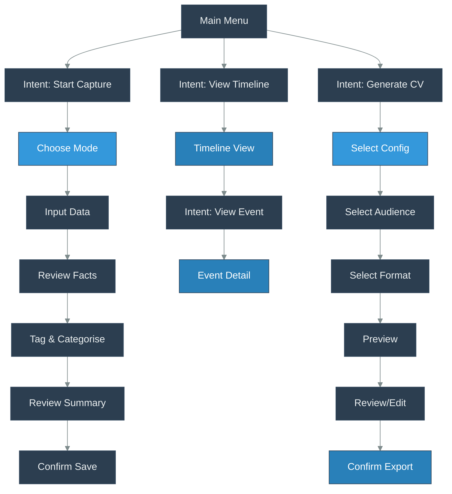

# KaRiya Workflow Diagram

## Workflow Overview

The diagram illustrates the primary user workflows in the KaRiya Career Journal CLI application, highlighting the key user intents and their corresponding flows.

### Main Menu Intents
1. **Start Capture**: Initiates the event capture workflow
2. **View Timeline**: Allows browsing of existing career events
3. **Generate CV**: Starts the CV composition process

### Event Capture Flow
- Choose capture strategy (Quick or Manual)
- Input event data
- Review extracted facts
- Tag and categorize events
- Review summary
- Confirm and save event

### Timeline View
- Browse timeline of events
- Select and view individual event details

### CV Composition Flow
- Select configuration
- Choose target audience
- Select export format
- Preview generated CV
- Review and edit
- Confirm export

## Design Principles
- Modular workflow design
- Clear user navigation
- Extensible architecture
- User-centric feature progression

## Workflow Notes
- Each workflow is designed to be independent yet interconnected
- Provides clear user guidance
- Supports multiple capture and generation modes

