# KaRiya Architecture Diagrams

**Version**: 1.0
**Last Updated**: 2026-01-28
**Status**: Current

This document provides comprehensive visual diagrams of the KaRiya architecture. For detailed implementation guidance, see:
- [TUI Architecture](./TUI_ARCHITECTURE.md)
- [Intent Diagram](../TUI_INTENT_DIAGRAM.md)
- [UIKit Guide](../UIKIT_GUIDE.md)

---

## Table of Contents

1. [System Architecture Overview](#1-system-architecture-overview)
2. [Layer Dependency Flow](#2-layer-dependency-flow)
3. [Data Flow Diagram](#3-data-flow-diagram)
4. [Intent Lifecycle](#4-intent-lifecycle)
5. [Screen/Modal Hierarchy](#5-screenmodal-hierarchy)
6. [Service Layer Architecture](#6-service-layer-architecture)
7. [Domain Model](#7-domain-model)
8. [UIKit Component Tree](#8-uikit-component-tree)
9. [Package Structure](#9-package-structure)

---

## 1. System Architecture Overview

High-level view of all layers and their relationships:

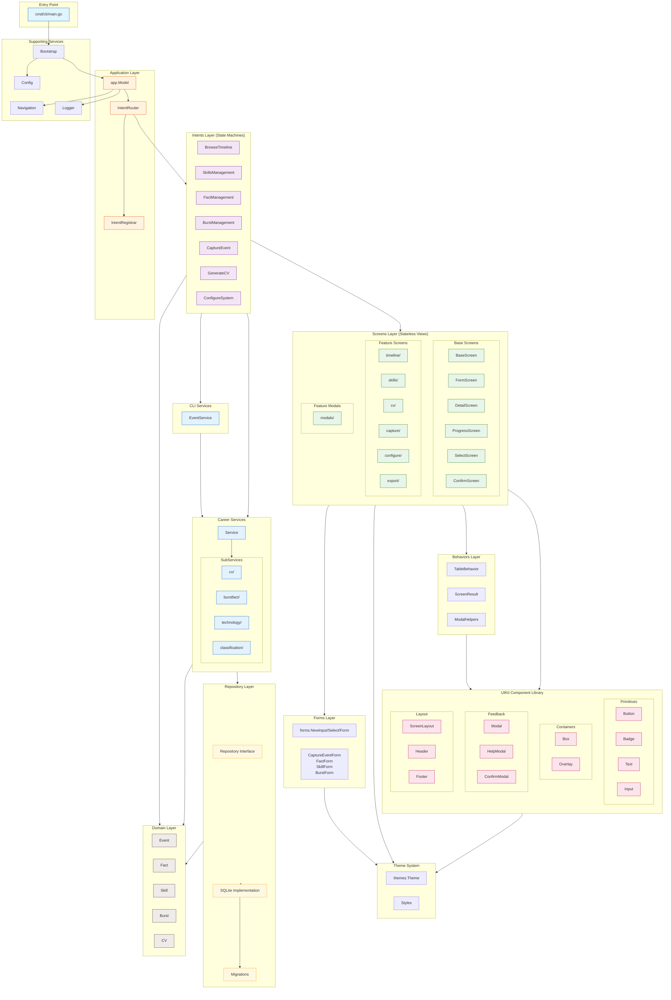

---

## 2. Layer Dependency Flow

Simplified view showing allowed import directions:

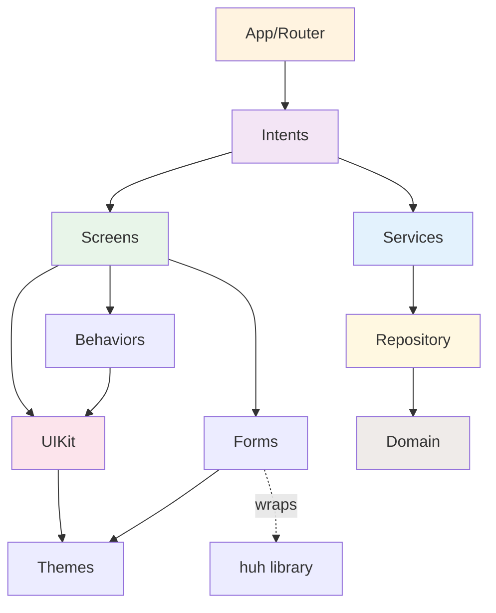

### Dependency Rules

| Layer | Can Import | NEVER Import |
|-------|------------|--------------|
| `intents/` | screens, uikit, behaviors, forms, services | - |
| `screens/` | uikit, behaviors, forms | **intents** |
| `uikit/` | themes only | **screens, intents** |
| `behaviors/` | uikit, themes | **screens, intents** |
| `forms/` | huh (only here), themes | screens, intents |

---

## 3. Data Flow Diagram

How data flows through the application during a typical user interaction:

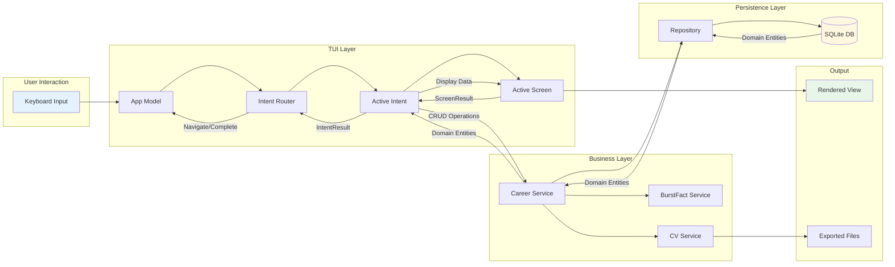

### Message Flow Detail

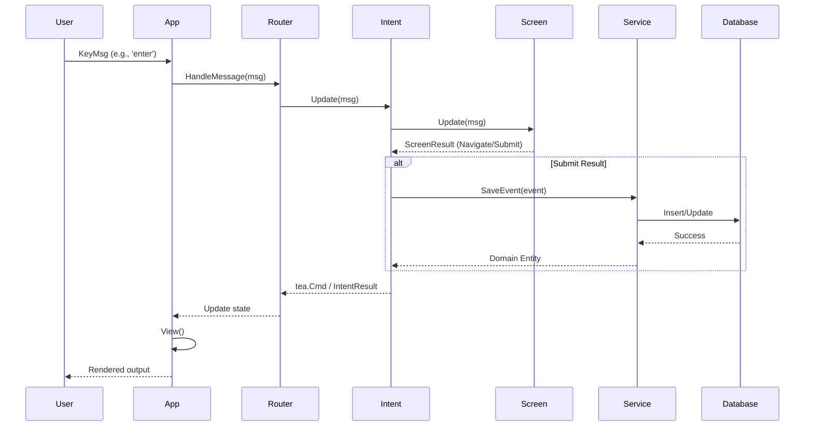

---

## 4. Intent Lifecycle

How intents manage state and transitions:

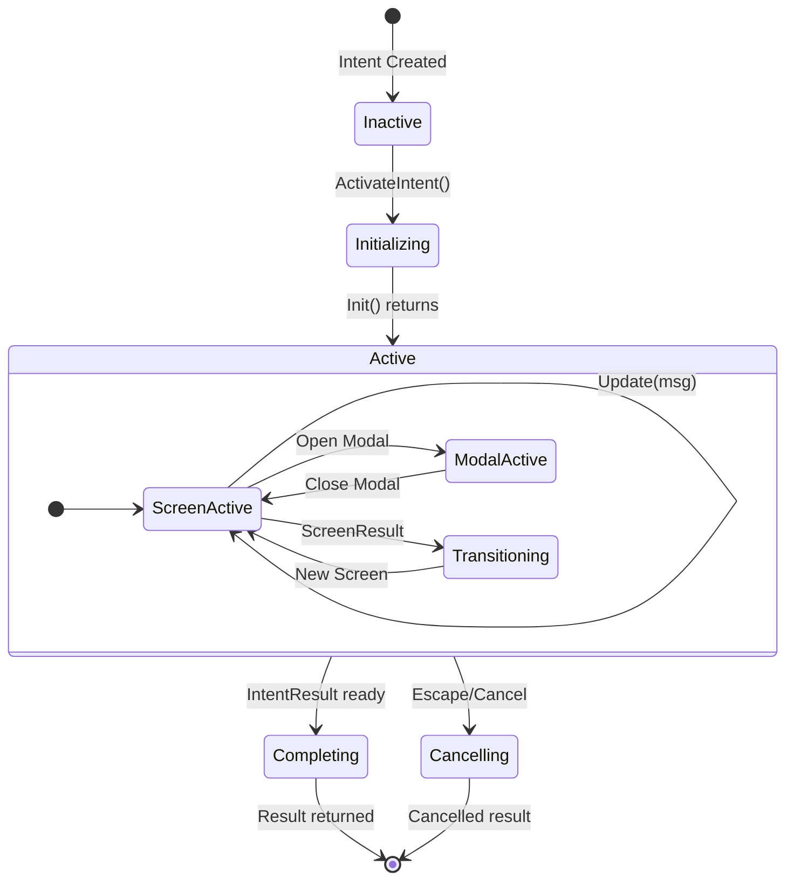

### Intent State Pattern (Reference: BrowseTimeline)

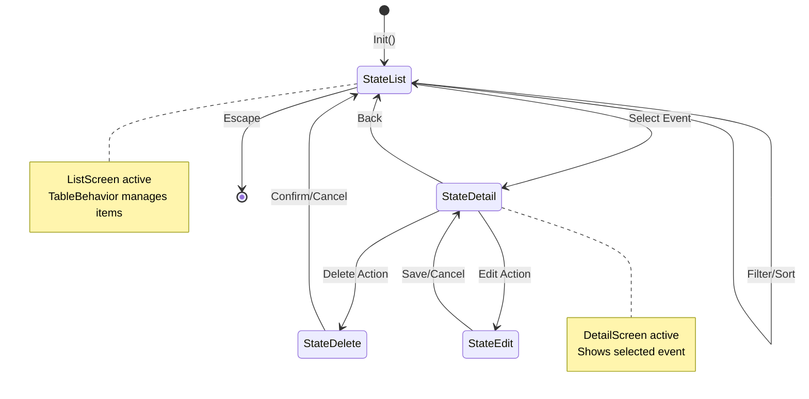

---

## 5. Screen/Modal Hierarchy

Organization of screens and modals by feature:

```mermaid
flowchart TB
    subgraph Base["Base Screens (screens/base/)"]
        direction LR
        BS[BaseScreen]
        FS[FormScreen]
        DS[DetailScreen]
        PS[ProgressScreen]
        SS[SelectScreen]
        CS[ConfirmScreen]
    end

    subgraph Timeline["Timeline (screens/timeline/)"]
        direction TB
        EL[EventListScreen]
        ED[EventDetailScreen]
        EDC[EventDeleteConfirmScreen]
        
        subgraph TLModals["modals/"]
            FM[FilterModal]
            SM[SortModal]
            SEM[SearchModal]
            EM[EditModal]
            DM[DetailModal]
            QAM[QuickAddModal]
        end
    end

    subgraph Skills["Skills (screens/skills/)"]
        direction TB
        SL[SkillListScreen]
        SDS[SkillDetailScreen]
        SFS[SkillFormScreen]
        SDelS[SkillDeleteScreen]
        
        subgraph SKModals["modals/"]
            SKF[FilterModal]
            SKS[SortModal]
            SKSE[SearchModal]
            SKAE[AddEditModal]
            SKD[DetailModal]
            SKE[EventsModal]
        end
    end

    subgraph CV["CV Generation (screens/cv/)"]
        direction TB
        AS[AudienceSelectScreen]
        PRS[ProfileSelectScreen]
        GS[GeneratingScreen]
        PVS[PreviewScreen]
        RS[ReviewScreen]
    end

    subgraph Capture["Capture (screens/capture/)"]
        direction TB
        STRS[StrategySelectScreen]
        EFS[EventFormScreen]
        ERS[EventReviewScreen]
        ESS[EventSubmitScreen]
    end

    subgraph Configure["Configure (screens/configure/)"]
        direction TB
        DSS[DomainSelectScreen]
        ESS2[EditSettingsScreen]
        RCS[ReviewChangesScreen]
        COS[ConfirmScreen]
        CMS[CompleteScreen]
        FLS[FailedScreen]
    end

    %% Inheritance
    BS --> EL
    BS --> ED
    BS --> SL
    DS --> SDS
    FS --> SFS
    SS --> AS
    SS --> PRS
    PS --> GS
    SS --> STRS
    FS --> EFS

    style Base fill:#e3f2fd
    style Timeline fill:#e8f5e9
    style Skills fill:#fff3e0
    style CV fill:#f3e5f5
    style Capture fill:#fce4ec
    style Configure fill:#efebe9
```

---

## 6. Service Layer Architecture

Detailed view of the service layer:

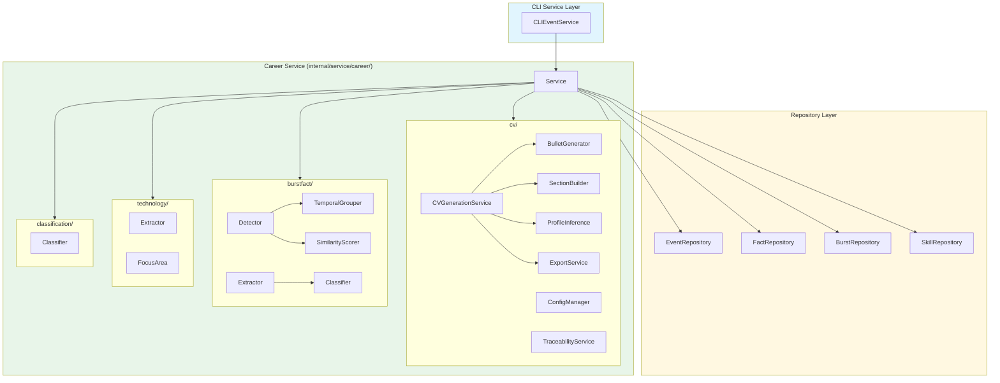

### Service Operations

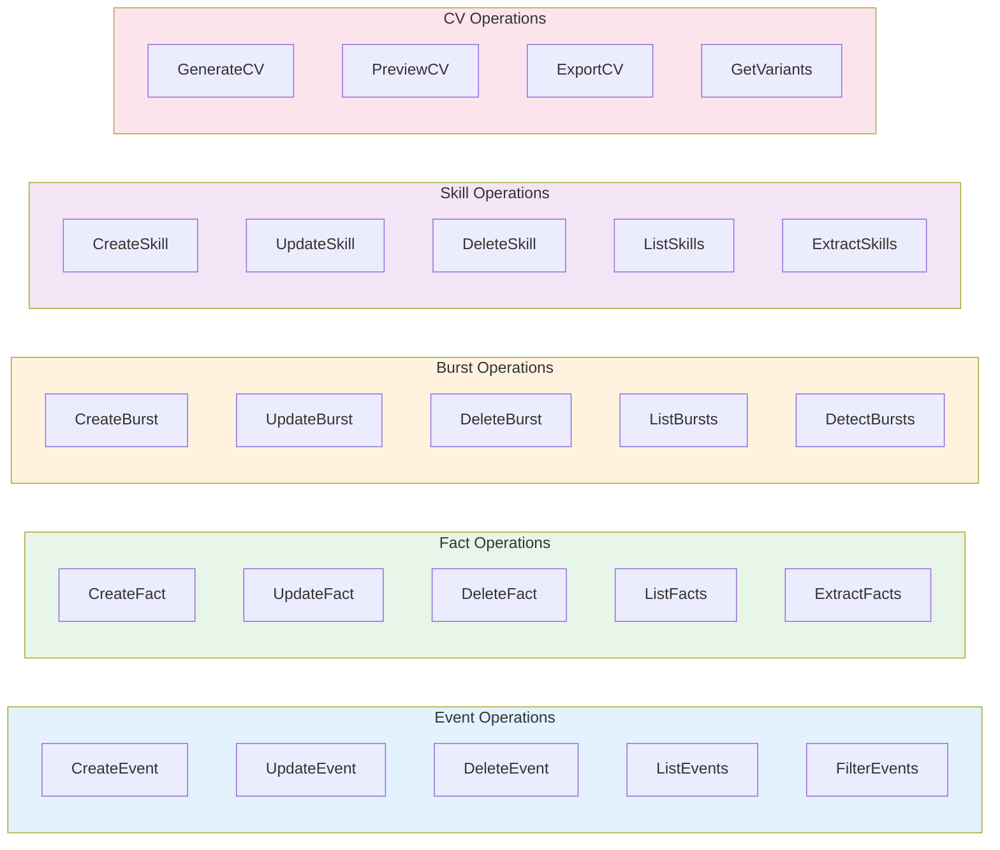

---

## 7. Domain Model

Core domain entities and their relationships:

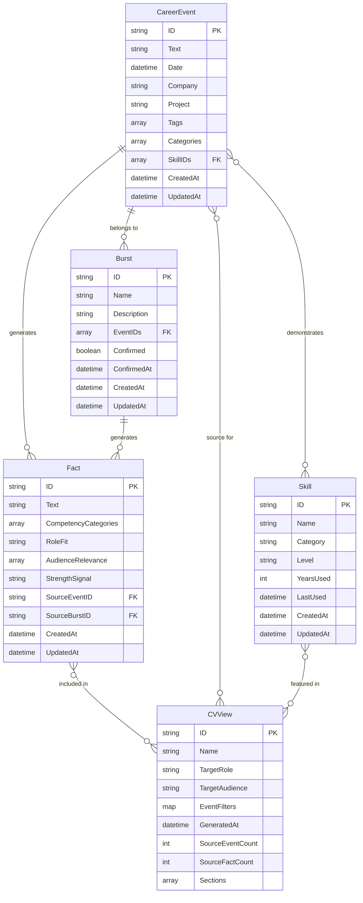

### Domain Concepts

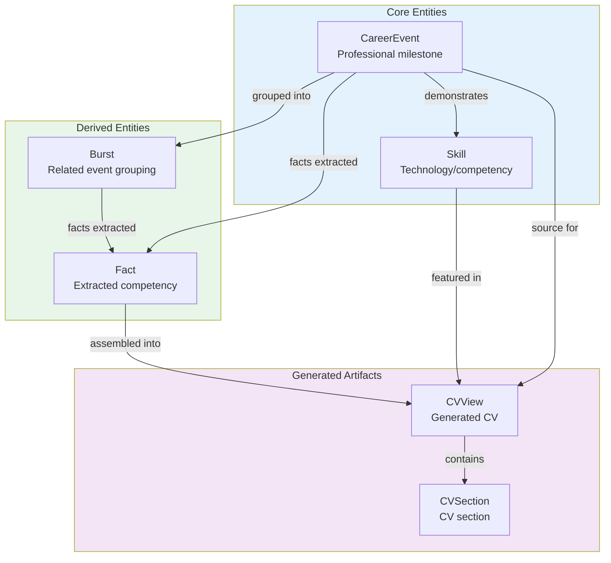

---

## 8. UIKit Component Tree

Organization of UIKit components:

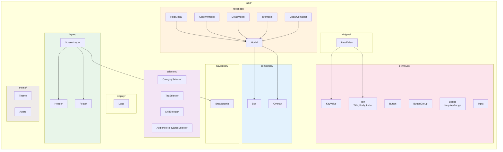

---

## 9. Package Structure

Directory layout of the codebase:

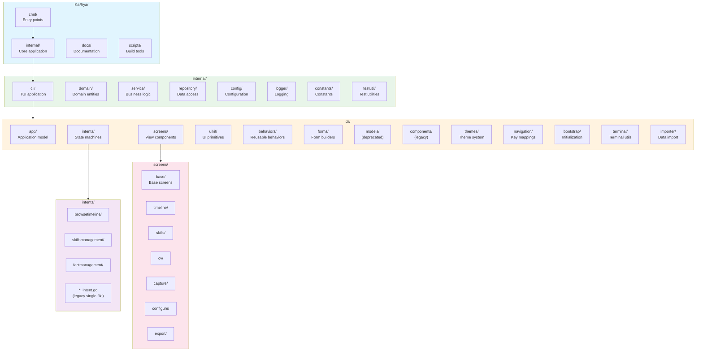

---

## Quick Reference

### Current Intent Implementations

| Intent | Location | Pattern | Status |
|--------|----------|---------|--------|
| BrowseTimeline | `intents/browsetimeline/` | Subdirectory (reference) | Modern |
| SkillsManagement | `intents/skillsmanagement/` | Subdirectory | Modern |
| FactManagement | `intents/factmanagement/` | Subdirectory | Modern |
| BurstManagement | `intents/burst_management*.go` | Single file | Legacy |
| CaptureEvent | `intents/capture_event*.go` | Single file | Legacy |
| GenerateCV | `intents/generate_cv*.go` | Single file | Legacy |
| ConfigureSystem | `intents/configure_system*.go` | Single file | Legacy |

### Key File Patterns

| Type | Location Pattern | Example |
|------|-----------------|---------|
| Intent (modern) | `intents/{feature}/intent.go` | `intents/browsetimeline/intent.go` |
| Screen | `screens/{feature}/{type}.go` | `screens/timeline/event_list.go` |
| Modal | `screens/{feature}/modals/{action}_modal.go` | `screens/timeline/modals/filter_modal.go` |
| Form | `forms/{entity}_form.go` | `forms/skill_form.go` |
| Service | `service/career/{domain}/` | `service/career/cv/` |

---

## Related Documentation

- [TUI Architecture](./TUI_ARCHITECTURE.md) - Detailed architecture guide
- [Intent Diagram](../TUI_INTENT_DIAGRAM.md) - Intent state flows
- [UIKit Guide](../UIKIT_GUIDE.md) - Component usage
- [Screen Specification](./SCREEN_SPECIFICATION.md) - Screen contracts
- [Intent Architecture Guide](../INTENT_ARCHITECTURE_GUIDE.md) - Intent patterns
