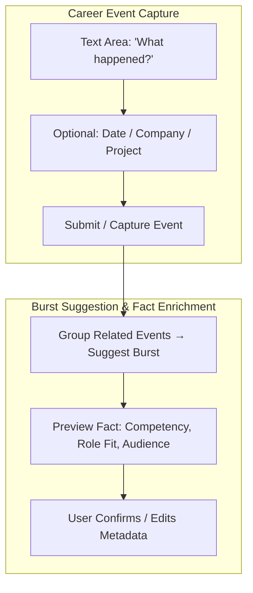

# Documentation Correction Summary

**Date**: 2026-01-14  
**Commit**: `998ac8b`  
**Impact**: Major correction - aligned workflow documentation with PRD

---

## Problem Identified

The `docs/workflows/EVENT_CAPTURE_WORKFLOW.md` contained **misleading and incorrect information** about the CaptureEvent workflow that contradicted the **PRD_MASTER.md** (the source of truth for product requirements).

### What Was Wrong

**Incorrect Statement** (lines 438-442):
```markdown
**Key Points**:
- Bursts and facts are **OPTIONAL** and **USER-TRIGGERED** during Review
- User can skip Review entirely with `Ctrl+S` from Form
- Enrichment (burst/fact extraction) happens **AFTER** event save, not before
```

This implied enrichment was optional/manual, but the PRD clearly shows it's **automatic**.

**Incorrect State Count**:
- Documentation said: **4 states** (Choose Strategy, Form, Review, Submit)
- Should be: **6 states** (Choose Strategy, Form, Pre-Save Review, Submit, Enrichment, Enrichment Review)

**Incorrect Screen Mockup** (Step 3: Review):
- Showed bursts and facts in pre-save review
- But bursts/facts don't exist until AFTER save and enrichment

---

## What the PRD Actually Says

### PRD Section 7: UI Canvas (Lines 222-258)



**Key insight**: `C[Submit / Capture Event]` → `D[Group Related Events → Suggest Burst]`

This is a **direct connection**, not optional. After submit, enrichment happens automatically.

### PRD Section 9a: Flow Diagram (Lines 515-554)

```
C[Submit Event → Stored as CareerEvent]
    ↓
D[System Groups Related Events → Suggest Burst]
    ↓
E[Preview Burst - Name, Events, Inferred Facts]
    ↓
F[User Confirms / Edits Burst & Fact Metadata]
```

Again, **automatic flow** from submit to enrichment to user confirmation.

---

## Corrections Made

### 1. Updated Workflow Complexity

**Before**: "High (4 states + 3 modal sub-flows)"  
**After**: "High (6 states + 3 modal sub-flows)"

### 2. Corrected Overview

**Before**: "Optional enrichment: Metadata, burst, and fact editing during review"  
**After**: "Automatic enrichment: Burst suggestion and fact extraction after save"

### 3. Rewrote State Machine Diagram

**Added two new states**:
- **Step 5: Enrichment** (async) - Automatic burst/fact extraction
- **Step 6: Enrichment Review** (intermediate) - User confirms enriched data

**Updated transitions**:
- `Submit →|Success| Enrichment`
- `Enrichment → Enrichment Review`
- `Enrichment Review →|Enter| Complete`

### 4. Split "Review" into Two States

**Pre-Save Review (Step 3)**:
- Purpose: Verify event metadata BEFORE save
- Shows: Event text, date, company, project, tags
- Does NOT show: Bursts or facts (not extracted yet)
- Keys: `e` for metadata editing, `Enter` to submit
- **'b' and 'f' keys do NOT work here**

**Enrichment Review (Step 6)**:
- Purpose: Confirm enriched data AFTER save
- Shows: Event summary + inferred bursts + inferred facts
- Keys: `b` for burst editing, `f` for fact editing, `Enter` to complete
- **'b' and 'f' keys ONLY work here**

### 5. Corrected Screen Mockups

**Pre-Save Review** (Step 3):
- Removed bursts/facts from the display
- Added note: "Enrichment (burst & fact extraction) will happen after the event is saved."

**Enrichment Review** (Step 6):
- Added two screen variations:
  - With enriched data (bursts/facts shown)
  - No enriched data (enrichment failed or no results)

### 6. Rewrote Workflow Paths Section

**Replaced misleading "Actual vs Ideal" section with**:
- Standard Path: Form → Pre-Save Review → Submit → Enrichment → Enrichment Review → Complete
- Quick Submit: Form → Ctrl+S → Submit → Enrichment → Enrichment Review → Complete
- Full Path: With metadata editing (pre-save) or burst/fact editing (post-save)

**Removed incorrect statements**:
- ❌ "Bursts and facts are OPTIONAL and USER-TRIGGERED"
- ❌ "User can bypass both and go straight to Submit"
- ❌ "Enrichment can be done later in bulk"

**Added correct principles**:
- ✅ "Enrichment is AUTOMATIC after successful save"
- ✅ "'b' and 'f' keys work ONLY in Enrichment Review, not Pre-Save Review"
- ✅ "Enrichment errors are non-fatal (proceed with empty results, can retry)"

### 7. Updated State Summary Table

| # | State | Type | Modals |
|---|-------|------|--------|
| 3 | Pre-Save Review | Intermediate | Yes (1 - metadata only) |
| 4 | Submit | Async | No |
| 5 | Enrichment | Async | No |
| 6 | Enrichment Review | Intermediate | Yes (2 - bursts & facts) |

### 8. Added Error Handling Details

**Enrichment errors** (per requirements):
- Show warning but still proceed to Enrichment Review
- Display empty bursts/facts with error message
- Allow user to retry enrichment with 'r' key
- Non-fatal - user can complete workflow even if enrichment fails

---

## Files Changed

### Modified

1. **`docs/workflows/EVENT_CAPTURE_WORKFLOW.md`**
   - **276 insertions, 510 deletions** (major rewrite)
   - Added 2 new state sections (Enrichment, Enrichment Review)
   - Rewrote state machine diagram
   - Corrected all workflow paths
   - Updated all keyboard shortcuts
   - Fixed screen mockups

2. **`internal/cli/intents/capture_event_workflow_e2e_test.go`**
   - **20 insertions** (added clarifying comments)
   - Header comment explaining PRD alignment
   - Updated test description to mention all 6 states
   - Clarified critical check comments

### Deleted

1. **`docs/development/E2E_TEST_EXPECTATIONS.md`**
   - Entire file deleted (417 lines)
   - Was based on incorrect understanding
   - Contradicted PRD requirements

---

## Impact on Other Documents

### Documents That Were Already Correct

**`docs/development/CAPTURE_EVENT_POST_SAVE_ISSUE.md`**:
- This document was CORRECT all along
- It accurately identified that post-save enrichment was missing
- No changes needed - keep as reference for implementation work

**`internal/cli/intents/capture_event_workflow_e2e_test.go`**:
- Test expectations were CORRECT (match PRD)
- Just added clarifying comments
- Test will pass once implementation is fixed

### Documents That May Need Updates

**`docs/workflows/diagrams/event_capture_flow.mermaid`**:
- If this exists, it needs to be regenerated with 6 states
- Should match the updated state machine diagram

**`docs/KEYBOARD_SHORTCUTS_GUIDE.md`**:
- May reference the old 4-state model
- Should be updated to reflect Pre-Save Review vs Enrichment Review split

**User guides** (if any exist):
- Check for references to "optional enrichment"
- Update to clarify automatic enrichment after save

---

## Key Takeaways

### For Developers

1. **PRD is the source of truth** - When in doubt, check PRD_MASTER.md
2. **The E2E test is correct** - It validates PRD requirements
3. **Implementation needs fixing** - Current code doesn't match PRD workflow
4. **6 states, not 4** - Enrichment and Enrichment Review are separate states

### For Users

1. **Enrichment is automatic** - Not optional, happens after every save
2. **Two review stages**:
   - Pre-save: Check your event data
   - Post-save: Confirm enriched bursts/facts
3. **'b' and 'f' keys** - Only work in Enrichment Review (post-save)
4. **Enrichment failures** - Non-fatal, can retry or proceed anyway

### For QA/Testing

1. **Test the 6-state workflow** - Not the old 4-state model
2. **Verify enrichment runs automatically** - After every successful save
3. **Check Enrichment Review state** - Should show bursts/facts
4. **Test 'b'/'f' key behavior** - Should NOT work in Pre-Save Review

---

## Next Steps

### Implementation Tasks

Based on the corrected documentation, the implementation needs:

1. **Add Enrichment state** (Step 5)
   - Automatic burst/fact extraction after save
   - Loading modal during extraction
   - Error handling for failed enrichment

2. **Add Enrichment Review state** (Step 6)
   - Display inferred bursts and facts
   - Allow editing with 'b' and 'f' keys
   - Allow retry with 'r' key if enrichment failed
   - Complete workflow on Enter

3. **Remove 'b'/'f' from Pre-Save Review** (Step 3)
   - These keys should do nothing (no bursts/facts exist yet)
   - Only 'e' key works (metadata editing)

4. **Update E2E test form submission**
   - Fix huh form interaction in E2E environment
   - Once fixed, test should pass (expectations are correct)

See `docs/development/CAPTURE_EVENT_POST_SAVE_ISSUE.md` for detailed implementation plan.

---

## References

- **PRD_MASTER.md** - Section 7 (UI Canvas), Section 9a (Flow Diagram)
- **EVENT_CAPTURE_WORKFLOW.md** - Corrected workflow documentation
- **CAPTURE_EVENT_POST_SAVE_ISSUE.md** - Implementation plan (still valid)
- **capture_event_workflow_e2e_test.go** - E2E test (expectations are correct)

---

## Commit Details

**Commit**: `998ac8b`  
**Message**: `docs(workflows): correct CaptureEvent workflow to match PRD`  
**Files Changed**: 3 files (2 modified, 1 deleted)  
**Lines Changed**: +276 insertions, -510 deletions  
**Branch**: `feature/task-42-tui-architecture-refactor`

---

**This was a MAJOR documentation correction. The workflow documentation now accurately reflects the PRD requirements.**
