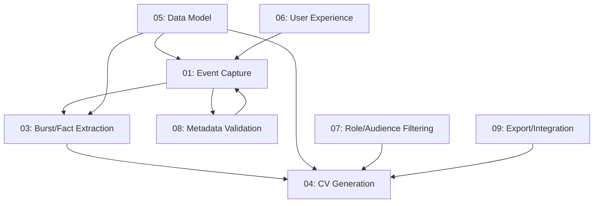

# Feature Specifications

This directory contains detailed specifications for each feature of the KaRiya Career Journal & CV Generator application.

## 📋 Feature List

### Core Features

1. **[01-career-event-capture.md](01-career-event-capture.md)**
   - Event capture strategies (Quick Capture, Manual Capture)
   - Validation rules and constraints
   - Allowed tags and metadata
   - Date handling (no restrictions)

2. **[03-burst-fact-extraction.md](03-burst-fact-extraction.md)**
   - Burst grouping (related events)
   - Fact extraction from events
   - Competency inference
   - Automatic classification

3. **[04-cv-generation.md](04-cv-generation.md)**
   - CV generation rules
   - Inclusion/exclusion criteria
   - Ranking priorities
   - Role-specific bullet caps

4. **[05-data-model-schema.md](05-data-model-schema.md)**
   - Canonical data models (CareerEvent, Burst, Fact, CVView)
   - YAML schema definitions
   - Entity relationships
   - Field specifications

5. **[06-user-experience.md](06-user-experience.md)**
   - UX principles
   - Event-centric input
   - Progressive enrichment
   - Editing capabilities

6. **[07-role-audience-filtering.md](07-role-audience-filtering.md)**
   - Role filtering logic
   - Audience targeting
   - Bullet cap rules
   - Ranking algorithms

7. **[08-metadata-validation.md](08-metadata-validation.md)**
   - Tag validation
   - Date constraints
   - Company/project metadata
   - Competency validation

8. **[09-export-integration.md](09-export-integration.md)**
   - Export formats (YAML, JSON)
   - Integration capabilities
   - Data portability
   - External system support

## 🔢 Feature Numbering

**Note**: Feature numbering currently jumps from 01 to 03. This is intentional for now:
- **01**: Career Event Capture (implemented)
- **02**: Reserved for future feature or renumbering
- **03-09**: Additional features as listed above

## 📖 Feature Documentation Format

Each feature specification includes:

### 1. Overview
- Feature purpose and goals
- User benefits
- System requirements

### 2. Functional Requirements
- Detailed feature behavior
- Input/output specifications
- Validation rules
- Business logic

### 3. Technical Specifications
- Data structures
- API endpoints (if applicable)
- Database schema
- Algorithms

### 4. User Stories
- "As a [user], I want [feature], so that [benefit]"
- Acceptance criteria
- Edge cases

### 5. Constraints & Limitations
- Known limitations
- Performance considerations
- Scalability concerns

## 🎯 Implementation Status

| Feature | Status | Coverage | Notes |
|---------|--------|----------|-------|
| 01-career-event-capture | ✅ Complete | 100% | Core functionality implemented |
| 03-burst-fact-extraction | ⏳ Planned | N/A | Classification system partial |
| 04-cv-generation | ⏳ Planned | N/A | Specification complete |
| 05-data-model-schema | ✅ Documented | N/A | Schema defined |
| 06-user-experience | 🚧 In Progress | N/A | CLI interface 70% complete |
| 07-role-audience-filtering | ⏳ Planned | N/A | Specification complete |
| 08-metadata-validation | ✅ Complete | 100% | Domain validation implemented |
| 09-export-integration | ⏳ Planned | N/A | Specification complete |

**Legend**:
- ✅ Complete: Fully implemented and tested
- 🚧 In Progress: Partially implemented
- ⏳ Planned: Specification complete, implementation pending
- N/A: Not applicable

## 🚀 Getting Started

### For Developers

**Implementing a Feature**:
1. Read the feature specification completely
2. Review related features for dependencies
3. Check [../PRD_MASTER.md](../PRD_MASTER.md) for system context
4. Follow [../rules/master-task-prompt.md](../rules/master-task-prompt.md) workflow
5. Write tests first (TDD approach)
6. Implement feature incrementally
7. Update documentation as needed

**Understanding Dependencies**:
- Feature 01 (Event Capture) is foundational - most features depend on it
- Feature 05 (Data Model) defines schema used across features
- Feature 03 (Burst/Fact Extraction) enables Feature 04 (CV Generation)
- Feature 07 (Filtering) depends on Feature 03 and 04

### For Product Managers

**Feature Prioritization**:
1. **MVP (Phase 1)**: Features 01, 05, 08
2. **Core (Phase 2)**: Features 03, 06, 09
3. **Advanced (Phase 3)**: Features 04, 07

**User Value Map**:
- High Value: 01, 03, 04, 06
- Medium Value: 07, 08, 09
- Foundational: 05

## 📊 Feature Dependencies



## 🔗 Related Documentation

### Product Requirements
- **[../PRD_MASTER.md](../PRD_MASTER.md)** - Complete system architecture and requirements
- **[../PRD_USER_STORIES.md](../PRD_USER_STORIES.md)** - User-centric feature descriptions
- **[../PRD_CLI.md](../PRD_CLI.md)** - CLI interface specifications

### Development Guidelines
- **[../rules/master-task-prompt.md](../rules/master-task-prompt.md)** - Development workflow
- **[../rules/go-guidelines.md](../rules/go-guidelines.md)** - Go coding standards
- **[../integration-test-strategy.md](../integration-test-strategy.md)** - Testing approach

### Implementation Tracking
- **[../../tasks/](../../tasks/)** - Task breakdowns and progress tracking

## 💡 Feature Design Principles

### 1. Event-Centric
All features revolve around career events as the core data structure.

### 2. Progressive Enhancement
Users can start simple and add detail over time.

### 3. Inference Over Input
System infers data when possible to reduce manual entry.

### 4. Flexible Output
Support multiple CV formats and audience targets.

### 5. Data Portability
Export and import capabilities for user control.

## 📝 Adding New Features

### Process

1. **Create Feature Spec**:
   ```bash
   # Use next available number
   touch docs/features/10-new-feature.md
   ```

2. **Follow Template**:
   - Overview
   - Functional Requirements
   - Technical Specifications
   - User Stories
   - Constraints

3. **Update This README**:
   - Add to feature list
   - Update implementation status
   - Add to dependency graph

4. **Cross-Reference**:
   - Update PRD_MASTER.md
   - Link from related features
   - Update task tracking

### Template

```markdown
# Feature: [Feature Name]

## Overview
[Purpose and goals]

## Functional Requirements
[Detailed behavior]

## Technical Specifications
[Implementation details]

## User Stories
- As a [user], I want [feature], so that [benefit]

## Acceptance Criteria
- [ ] Criterion 1
- [ ] Criterion 2

## Constraints & Limitations
[Known issues]

## Dependencies
- [Related features]

## Implementation Notes
[Technical guidance]
```

## ✅ Feature Completion Checklist

For each feature, ensure:

- [ ] Specification document complete
- [ ] Functional requirements clear
- [ ] User stories defined
- [ ] Acceptance criteria listed
- [ ] Technical design documented
- [ ] Dependencies identified
- [ ] Tests written (TDD)
- [ ] Implementation complete
- [ ] Integration tested
- [ ] Documentation updated

## 🎨 Feature Interaction Examples

### Example 1: Capturing and Generating CV

1. User captures events (Feature 01)
2. System validates metadata (Feature 08)
3. System extracts facts and groups bursts (Feature 03)
4. User requests CV for specific role (Feature 07)
5. System generates CV with filtered content (Feature 04)
6. User exports to YAML (Feature 09)

### Example 2: Backfilling Career History

1. User selects Manual Capture strategy (Feature 01, Feature 06)
2. User enters historical events with all details (Feature 01)
3. System validates dates and tags (Feature 08)
4. System infers competencies (Feature 03)
5. Events stored in canonical format (Feature 05)

## 📊 Feature Metrics

### Coverage by Feature

| Feature | Domain | Service | Repository | Total |
|---------|--------|---------|------------|-------|
| 01 | 100% | 100% | 83.6% | 94.5% |
| 03 | N/A | 84.2% | N/A | 84.2% |
| 08 | 100% | 100% | N/A | 100% |
| Others | TBD | TBD | TBD | TBD |

## 🔍 Feature Search Guide

| I need to... | Check this feature |
|--------------|-------------------|
| Capture events | 01-career-event-capture |
| Generate CVs | 04-cv-generation |
| Filter by role | 07-role-audience-filtering |
| Validate data | 08-metadata-validation |
| Export data | 09-export-integration |
| Understand schema | 05-data-model-schema |
| Improve UX | 06-user-experience |
| Extract facts | 03-burst-fact-extraction |

---

**Last Updated**: 2025-12-23
**Directory**: `docs/features/`
**Total Features**: 8 (numbered 01, 03-09)
**Status**: Core features implemented, advanced features planned
**Next Feature**: To be determined (possibly 02 or 10)

