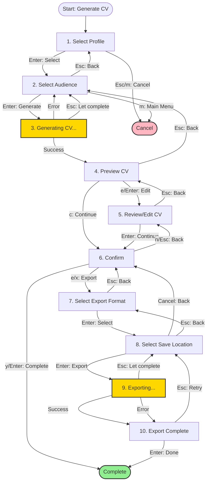

# CV Generation Workflow

**Complete Guide to Generating Role and Audience-Specific CVs**

**Last Updated**: 2026-01-12
**Workflow Complexity**: High (10 states)
**Implementation**: `internal/cli/intents/generate_cv_intent.go`

---

## Table of Contents

1. [Overview](#overview)
2. [Workflow States & Navigation](#workflow-states--navigation)
3. [Step-by-Step Guide](#step-by-step-guide)
4. [Complete Keyboard Reference](#complete-keyboard-reference)
5. [Navigation Patterns](#navigation-patterns)
6. [Common Workflows](#common-workflows)
7. [Troubleshooting](#troubleshooting)
8. [Technical Details](#technical-details)

---

## Overview

### What This Workflow Does

Generate professional, role-specific CVs from your career events with:
- **Profile selection**: Choose from configured CV profiles
- **Audience targeting**: Hiring Manager, Recruiter, or Peer
- **Real-time generation**: CV generated with progress indicator
- **Interactive preview**: Scrollable CV preview with metadata
- **Export options**: Export to Text, Markdown, or YAML formats
- **Full navigation**: Back navigation with context preservation

### When to Use

- Creating CVs for job applications
- Tailoring CVs for specific audiences
- Reviewing generated CVs before export
- Exporting CVs in multiple formats

### Prerequisites

- Career events captured in KaRiya
- At least one CV profile configured
- Events have been enriched with metadata (optional but improves CV quality)

---

## Workflow States & Navigation

### State Machine Diagram



**Diagram Location**: `docs/workflows/diagrams/cv_generation_flow.mermaid` (generated by script)

### State Summary Table

| # | State | Type | Can Go Back | Async |
|---|-------|------|-------------|-------|
| 1 | SelectProfile | Root | No (cancels) | No |
| 2 | SelectAudience | Intermediate | Yes | No |
| 3 | Generating | Async | Yes (background) | Yes |
| 4 | Preview | Intermediate | Yes | No |
| 5 | Review | Intermediate | Yes | No |
| 6 | Confirm | Intermediate | Yes | No |
| 7 | ExportSelectFormat | Intermediate | Yes | No |
| 8 | ExportSelectLocation | Intermediate | Yes | No |
| 9 | Exporting | Async | Yes (background) | Yes |
| 10 | ExportComplete | Final | Yes (retry) | No |

---

## Step-by-Step Guide

### Step 1: Select Profile

**What it shows**: List of configured CV profiles

**Screen**:
```
┌────────────────────────────────────────────────────────────┐
│ KaRiya > Main Menu > Generate CV > Select Profile          │
├────────────────────────────────────────────────────────────┤
│                                                            │
│  Select CV Profile                                         │
│                                                            │
│  ▶  Senior IC Profile       (42 events, 15 facts)         │
│     Principal Profile       (38 events, 18 facts)         │
│     EM Profile              (29 events, 12 facts)         │
│                                                            │
├────────────────────────────────────────────────────────────┤
│ ↑/k ↓/j Navigate  Enter Select  Esc Cancel  m Main  q Quit│
└────────────────────────────────────────────────────────────┘
```

**Keyboard Shortcuts**:
| Key | Action | Result |
|-----|--------|--------|
| `↑` or `k` | Navigate up | Move to previous profile |
| `↓` or `j` | Navigate down | Move to next profile |
| `Enter` | Select profile | Proceed to audience selection |
| `Esc` | Cancel | Return to main menu |
| `m` | Main menu | Return to main menu |
| `q` | Quit | Exit application |

**Decision Points**:
- Which profile best matches target role?
- Does profile have sufficient events for CV?

**Common Issues**:
- No profiles configured → Configure CV profile first in settings
- Profile empty → Capture career events first

---

### Step 2: Select Audience

**What it shows**: Target audience options for selected profile

**Screen**:
```
┌────────────────────────────────────────────────────────────┐
│ KaRiya > Main Menu > Generate CV > Select Audience         │
├────────────────────────────────────────────────────────────┤
│                                                            │
│  Select Target Audience for: Senior IC Profile             │
│                                                            │
│  ▶  Hiring Manager      (Outcomes, leadership, impact)    │
│     Recruiter           (Skills, competencies, achievements)│
│     Peer                (Technical depth, collaboration)   │
│                                                            │
├────────────────────────────────────────────────────────────┤
│ ↑/k ↓/j Navigate  Enter Generate  Esc Back  m Main  q Quit│
└────────────────────────────────────────────────────────────┘
```

**Keyboard Shortcuts**:
| Key | Action | Result |
|-----|--------|--------|
| `↑` or `k` | Navigate up | Move to previous audience |
| `↓` or `j` | Navigate down | Move to next audience |
| `Enter` | Generate CV | Start CV generation process |
| `Esc` | Back | Return to profile selection |
| `m` | Main menu | Return to main menu |
| `q` | Quit | Exit application |

**Decision Points**:
- **Hiring Manager**: Best for demonstrating leadership and business impact
- **Recruiter**: Best for highlighting skills and qualifications
- **Peer**: Best for showcasing technical expertise and collaboration

**Common Issues**:
- Unsure which audience → Choose based on who will read your CV first

---

### Step 3: Generating CV

**What it shows**: Progress indicator while CV is being generated

**Screen**:
```
┌────────────────────────────────────────────────────────────┐
│ KaRiya > Main Menu > Generate CV > Generating              │
├────────────────────────────────────────────────────────────┤
│                                                            │
│                                                            │
│                     ⏳ Generating CV...                    │
│                                                            │
│              Please wait while we create your CV           │
│                                                            │
│                                                            │
├────────────────────────────────────────────────────────────┤
│ Esc Let generation complete  m Main Menu  q Quit          │
└────────────────────────────────────────────────────────────┘
```

**Keyboard Shortcuts**:
| Key | Action | Result |
|-----|--------|--------|
| `Esc` | Background | Let generation complete in background, return to audience |
| `m` | Main menu | Cancel generation, return to main menu |
| `q` | Quit | Exit application |

**What Happens**:
1. CVGenerationService filters events by role and audience
2. EnhancedBulletGenerator creates professional bullet points
3. Events ranked by ownership, strategy, and outcome
4. Bullet caps applied per role (Principal: 3-4, Senior IC: 4-5)
5. CV metadata compiled (events count, facts count, generation date)

**Typical Duration**: 100-500ms for ≤500 events

**Common Issues**:
- Generation takes too long → Check database performance
- Empty CV → Ensure profile has compatible events
- Generation error → Check logs for specific issue

---

### Step 4: Preview CV

**What it shows**: Scrollable CV preview with metadata

**Screen**:
```
┌────────────────────────────────────────────────────────────┐
│ KaRiya > Main Menu > Generate CV > Preview                 │
├────────────────────────────────────────────────────────────┤
│                                                            │
│  Senior IC CV - Hiring Manager Audience                   │
│  Generated: 2024-01-12  |  42 events  |  15 facts         │
│  ───────────────────────────────────────────────────────  │
│                                                            │
│  ## Professional Summary                                   │
│  Senior Software Engineer with 8+ years experience...     │
│                                                            │
│  ## Experience                                             │
│                                                            │
│  ### Acme Corp - Senior Engineer (2020-Present)           │
│  • Led platform migration to Ruby 3.1, improving...       │
│  • Architected microservices infrastructure...            │
│  • Mentored 5 junior engineers in best practices...       │
│                                                            │
│  [Scroll for more...]                                     │
│                                                            │
├────────────────────────────────────────────────────────────┤
│ ↑/k ↓/j Scroll  PgUp/PgDn Page  e/Enter Edit  c Confirm   │
│ Esc Back  m Main  q Quit                                  │
└────────────────────────────────────────────────────────────┘
```

**Keyboard Shortcuts**:
| Key | Action | Result |
|-----|--------|--------|
| `↑` or `k` | Scroll up | Move up one line |
| `↓` or `j` | Scroll down | Move down one line |
| `PgUp` | Page up | Scroll up one page |
| `PgDn` | Page down | Scroll down one page |
| `e` or `Enter` | Edit | Proceed to review/edit screen |
| `c` | Continue | Proceed to confirmation |
| `Esc` | Back | Return to audience selection |
| `m` | Main menu | Return to main menu |
| `q` | Quit | Exit application |

**What to Review**:
- Professional summary accuracy
- Experience bullets match actual work
- Skills section complete
- No aspirational language or inflated claims
- Dates and company names correct

**Common Issues**:
- CV too short → Capture more career events
- Bullets lack impact → Enrich events with better descriptions
- Missing key experiences → Check profile/audience filters

---

### Step 5: Review/Edit CV

**What it shows**: CV review interface (placeholder - full editing not yet implemented)

**Current Functionality**: Limited review, primarily for navigation. Full editing capabilities planned for future release.

**Keyboard Shortcuts**:
| Key | Action | Result |
|-----|--------|--------|
| `Enter` | Continue | Proceed to confirmation |
| `Esc` | Back | Return to preview |
| `m` | Main menu | Return to main menu |
| `q` | Quit | Exit application |

**Future Features** (Planned):
- Inline bullet editing
- Section reordering
- Fact source inspection
- Bullet inclusion/exclusion toggle

---

### Step 6: Confirm

**What it shows**: Confirmation screen with CV summary and options

**Screen**:
```
┌────────────────────────────────────────────────────────────┐
│ KaRiya > Main Menu > Generate CV > Confirm                 │
├────────────────────────────────────────────────────────────┤
│                                                            │
│  ✓ CV Generated Successfully                              │
│                                                            │
│  Profile:    Senior IC                                     │
│  Audience:   Hiring Manager                               │
│  Events:     42                                           │
│  Facts:      15                                           │
│  Generated:  2024-01-12 14:23:45                          │
│                                                            │
│  What would you like to do?                               │
│                                                            │
│  • Complete (y/Enter) - Finish without exporting          │
│  • Export (e/x) - Export to file or clipboard             │
│  • Back (n/Esc) - Return to review                       │
│                                                            │
├────────────────────────────────────────────────────────────┤
│ y/Enter Complete  e/x Export  n/Esc Back  m Main  q Quit  │
└────────────────────────────────────────────────────────────┘
```

**Keyboard Shortcuts**:
| Key | Action | Result |
|-----|--------|--------|
| `y` or `Enter` | Complete | Finish workflow without exporting |
| `e` or `x` | Export | Proceed to export format selection |
| `n` or `Esc` | Back | Return to review |
| `m` | Main menu | Return to main menu |
| `q` | Quit | Exit application |

**Decision Points**:
- Export now or later?
- Need multiple formats?

---

### Step 7: Export - Select Format

**What it shows**: Export format options

**Screen**:
```
┌────────────────────────────────────────────────────────────┐
│ KaRiya > Main Menu > Generate CV > Export > Select Format  │
├────────────────────────────────────────────────────────────┤
│                                                            │
│  Select Export Format                                      │
│                                                            │
│  ▶  Text         Plain text (.txt)                        │
│     Markdown     Formatted markdown (.md)                 │
│     YAML         Structured YAML (.yaml)                  │
│                                                            │
├────────────────────────────────────────────────────────────┤
│ ↑/k ↓/j Navigate  Enter Select  Esc Back  m Main  q Quit  │
└────────────────────────────────────────────────────────────┘
```

**Keyboard Shortcuts**:
| Key | Action | Result |
|-----|--------|--------|
| `↑` or `k` | Navigate up | Move to previous format |
| `↓` or `j` | Navigate down | Move to next format |
| `Enter` | Select | Proceed to location selection |
| `Esc` | Back | Return to confirmation |
| `m` | Main menu | Return to main menu |
| `q` | Quit | Exit application |

**Format Options**:
- **Text**: Plain text, universally compatible
- **Markdown**: Formatted, suitable for GitHub/websites
- **YAML**: Structured data, machine-readable

---

### Step 8: Export - Select Location

**What it shows**: Save location options

**Screen**:
```
┌────────────────────────────────────────────────────────────┐
│ KaRiya > Main Menu > Generate CV > Export > Select Location│
├────────────────────────────────────────────────────────────┤
│                                                            │
│  Select Save Location                                      │
│                                                            │
│  ▶  File         Save to file on disk                     │
│     Clipboard    Copy to clipboard                        │
│     Cancel       Return to confirmation                   │
│                                                            │
├────────────────────────────────────────────────────────────┤
│ ↑/k ↓/j Navigate  Enter Select  Esc Back  m Main  q Quit  │
└────────────────────────────────────────────────────────────┘
```

**Keyboard Shortcuts**:
| Key | Action | Result |
|-----|--------|--------|
| `↑` or `k` | Navigate up | Move to previous option |
| `↓` or `j` | Navigate down | Move to next option |
| `Enter` | Select | Start export OR return to confirm (if Cancel) |
| `Esc` | Back | Return to format selection |
| `m` | Main menu | Return to main menu |
| `q` | Quit | Exit application |

**Location Options**:
- **File**: Saves to `~/.kariya/exports/cv_<timestamp>.<ext>`
- **Clipboard**: Copies to system clipboard (paste anywhere)
- **Cancel**: Returns to confirmation without exporting

---

### Step 9: Exporting

**What it shows**: Export progress indicator

**Screen**:
```
┌────────────────────────────────────────────────────────────┐
│ KaRiya > Main Menu > Generate CV > Export > Exporting      │
├────────────────────────────────────────────────────────────┤
│                                                            │
│                                                            │
│                     📊 Exporting CV...                     │
│                                                            │
│                Format: Markdown                            │
│                Location: File                              │
│                                                            │
│                                                            │
├────────────────────────────────────────────────────────────┤
│ Esc Let export complete  m Main Menu  q Quit              │
└────────────────────────────────────────────────────────────┘
```

**Keyboard Shortcuts**:
| Key | Action | Result |
|-----|--------|--------|
| `Esc` | Background | Let export complete, return to location |
| `m` | Main menu | Cancel export, return to main menu |
| `q` | Quit | Exit application |

**What Happens**:
1. ExportService marshals CV to selected format
2. File written to disk OR copied to clipboard
3. Export result returned (success/error)

**Typical Duration**: <100ms

---

### Step 10: Export Complete

**What it shows**: Export result (success or error)

**Screen (Success)**:
```
┌────────────────────────────────────────────────────────────┐
│ KaRiya > Main Menu > Generate CV > Export > Complete       │
├────────────────────────────────────────────────────────────┤
│                                                            │
│  ✅ Export Successful!                                     │
│                                                            │
│  Format:      Markdown                                     │
│  Location:    File                                        │
│  File Path:   ~/.kariya/exports/cv_20240112_142345.md    │
│  File Size:   12.4 KB                                     │
│                                                            │
│  Your CV has been exported successfully.                  │
│                                                            │
├────────────────────────────────────────────────────────────┤
│ Enter Done  Esc Retry  m Main  q Quit                     │
└────────────────────────────────────────────────────────────┘
```

**Keyboard Shortcuts**:
| Key | Action | Result |
|-----|--------|--------|
| `Enter` | Done | Complete workflow |
| `Esc` | Retry | Return to location selection (for different export) |
| `m` | Main menu | Return to main menu |
| `q` | Quit | Exit application |

**On Error**:
- Error message displayed
- `r` key retries export
- `Esc` returns to location selection

---

## Complete Keyboard Reference

### Universal Shortcuts (All States)

| Key | Action | Works In |
|-----|--------|----------|
| `q` | Quit application | All states |
| `m` | Main menu | All states |
| `?` | Toggle help | All states (future) |
| `Ctrl+C` | Force quit | All states |

### Navigation Shortcuts

| Key | Alternative | Action | Works In |
|-----|-------------|--------|----------|
| `↑` | `k` | Navigate up | SelectProfile, SelectAudience, ExportFormat, ExportLocation |
| `↓` | `j` | Navigate down | SelectProfile, SelectAudience, ExportFormat, ExportLocation |
| `↑` | `k` | Scroll up | Preview |
| `↓` | `j` | Scroll down | Preview |
| `PgUp` | - | Page up | Preview |
| `PgDn` | - | Page down | Preview |
| `Enter` | - | Select/Confirm | All states |
| `Esc` | - | Back/Cancel | All states |

### State-Specific Shortcuts

| State | Key | Action |
|-------|-----|--------|
| **Preview** | `e` | Edit CV |
| **Preview** | `c` | Continue to confirm |
| **Confirm** | `y` | Complete workflow |
| **Confirm** | `e` or `x` | Export CV |
| **Confirm** | `n` | Go back |
| **ExportComplete** | `r` | Retry export (on error) |

---

## Navigation Patterns

### Forward Navigation

**Standard Path** (no export):
```
SelectProfile → SelectAudience → Generating → Preview → Review → Confirm → Complete
```

**Export Path**:
```
SelectProfile → SelectAudience → Generating → Preview → Review → Confirm → 
    ExportFormat → ExportLocation → Exporting → ExportComplete → Complete
```

### Back Navigation

All states support back navigation via `Esc`:

| From State | Esc Goes To |
|------------|-------------|
| SelectProfile | Main Menu (cancel) |
| SelectAudience | SelectProfile |
| Generating | SelectAudience (background) |
| Preview | SelectAudience |
| Review | Preview |
| Confirm | Review |
| ExportFormat | Confirm |
| ExportLocation | ExportFormat |
| Exporting | ExportLocation (background) |
| ExportComplete | ExportLocation (retry) |

### Error Recovery

**Generation Error**:
```
Generating (error) → SelectAudience
User can select different profile or audience and retry
```

**Export Error**:
```
Exporting (error) → ExportComplete (shows error)
User can:
- Press 'r' to retry export
- Press Esc to change location
- Press 'm' to cancel
```

### Context Preservation

Back navigation preserves context via IntentResult metadata:

```go
// When returning from Preview to SelectAudience
result.WithMetadata("scroll_position", scrollPos)
result.WithMetadata("selected_profile", profileID)

// When returning to Preview
if pos, ok := prevResult.GetMetadata("scroll_position"); ok {
    i.viewport.SetYOffset(pos.(int))
}
```

---

## Common Workflows

### Workflow 1: Quick CV Generation (No Export)

**Goal**: Generate and review CV without exporting

**Steps**:
1. Navigate to profile: `↓` `↓` `Enter`
2. Select audience: `Enter` (default: Hiring Manager)
3. Wait for generation: (automatic)
4. Review preview: `↓` `↓` `↓` (scroll)
5. Continue: `c`
6. Complete: `y` or `Enter`

**Time**: ~30 seconds

---

### Workflow 2: Generate and Export to File

**Goal**: Create CV and save to disk

**Steps**:
1. Select profile: `Enter`
2. Select audience: `↓` `Enter` (Recruiter)
3. Wait for generation
4. Preview: `c` (skip detailed review)
5. Confirm: `e` (export)
6. Format: `↓` `Enter` (Markdown)
7. Location: `Enter` (File)
8. Wait for export
9. Complete: `Enter`

**Time**: ~45 seconds

---

### Workflow 3: Generate and Copy to Clipboard

**Goal**: Copy CV to clipboard for pasting

**Steps**:
1. Select profile: `Enter`
2. Select audience: `Enter`
3. Wait for generation
4. Preview: `c`
5. Confirm: `x`
6. Format: `Enter` (Text)
7. Location: `↓` `Enter` (Clipboard)
8. Wait for export
9. Complete: `Enter`

**Time**: ~40 seconds
**Result**: CV copied to clipboard, paste anywhere

---

### Workflow 4: Iterative Refinement

**Goal**: Generate CV, review, go back and change audience

**Steps**:
1. Select profile: `Enter`
2. Select audience: `Enter` (Hiring Manager)
3. Wait for generation
4. Preview: Review bullets
5. Not satisfied → `Esc` (go back)
6. Change audience: `↓` `Enter` (Peer)
7. Wait for generation
8. Preview: Better bullets
9. Continue: `c` → `y`

**Time**: ~60 seconds
**Benefit**: Compare different audience filters

---

## Troubleshooting

### Empty or Incomplete CV

**Symptoms**:
- CV preview shows no bullets
- CV preview shows < 3 bullets
- Missing sections (experience, skills, etc.)

**Causes**:
1. Profile has no compatible events for selected audience
2. Events lack sufficient metadata for bullet generation
3. Fact extraction has not been performed

**Solutions**:
1. **Check event count**: Ensure profile has ≥10 events
2. **Enrich events**: Add company, project, tags to events
3. **Run fact extraction**: Review events in Metadata Review screen
4. **Try different audience**: Some audiences filter more aggressively
5. **Check profile configuration**: Verify role/audience settings in profile

**Command to check**:
```bash
# From main menu
l → f → role:"Senior IC" → Enter
# Verify event count matches profile
```

---

### Generation Fails or Hangs

**Symptoms**:
- Generation takes > 5 seconds
- Error message appears during generation
- Application freezes on "Generating CV..."

**Causes**:
1. Database performance issue
2. Too many events (>1000)
3. Corrupt event data
4. Service failure

**Solutions**:
1. **Wait 10 seconds** - Generation may complete
2. **Press Esc** - Let generation complete in background
3. **Check database** - Run `make test` to verify database integrity
4. **Check logs** - Look for errors in application logs
5. **Restart application** - `q` then restart
6. **Reduce event count** - Filter profile to fewer events

---

### Export Fails

**Symptoms**:
- Export shows error message
- File not created in expected location
- Clipboard copy fails

**Causes**:
1. Insufficient disk space
2. Permission denied for export directory
3. Clipboard not available (SSH/remote sessions)
4. Invalid file path

**Solutions**:
1. **Check disk space**: Ensure ≥100MB free
2. **Check permissions**: Verify write access to `~/.kariya/exports/`
3. **Try different location**: Use Clipboard if File fails (or vice versa)
4. **Check file path**: Ensure `~/.kariya/exports/` directory exists
5. **Retry export**: Press `r` after error

**Manual export check**:
```bash
# Verify export directory exists
ls -la ~/.kariya/exports/

# Check recent exports
ls -lt ~/.kariya/exports/ | head

# Check disk space
df -h ~/.kariya/
```

---

### Cannot Navigate Back

**Symptoms**:
- Esc key doesn't go back
- Stuck in current state
- Cannot cancel workflow

**Causes**:
1. In async state (Generating/Exporting)
2. Modal overlay active
3. Keyboard input not captured

**Solutions**:
1. **Wait for async operation**: Let generation/export complete
2. **Press 'm'**: Always returns to main menu
3. **Press 'q'**: Quit application as last resort
4. **Check terminal**: Ensure terminal has focus
5. **Restart if needed**: `Ctrl+C` to force quit, then restart

---

## Technical Details

### IntentResult Data Flow

CV Generation uses `IntentResult[*GenerateCVResult]`:

```go
type GenerateCVResult struct {
    CV          *domain.CV
    ProfileID   string
    Audience    string
    EventCount  int
    FactCount   int
    GeneratedAt time.Time
    ExportInfo  *ExportInfo // If exported
}
```

**Result flow**:
```
SelectProfile → IntentResult{status: Intermediate, data: profileID}
SelectAudience → IntentResult{status: Intermediate, data: audience}
Generating → IntentResult{status: Intermediate, data: cv}
Confirm → IntentResult{status: Completed, data: GenerateCVResult}
```

### Context Preservation

**Metadata preserved on back navigation**:

```go
// Preview → SelectAudience
result.WithMetadata("scroll_position", viewport.YOffset)
result.WithMetadata("selected_profile", profileID)

// SelectAudience → Preview (on forward)
if pos, ok := prevResult.GetMetadata("scroll_position"); ok {
    intent.viewport.SetYOffset(pos.(int))
}
```

### Async Operations

**Generating CV**:
```go
func (i *GenerateCVIntent) generateCVAsync() tea.Cmd {
    return func() tea.Msg {
        cv, err := i.cvService.GenerateCVFromConfig(
            i.selectedProfile,
            i.selectedAudience,
        )
        if err != nil {
            return CVGenerationErrorMsg{err}
        }
        return CVGenerationCompleteMsg{cv}
    }
}
```

**Exporting CV**:
```go
func (i *GenerateCVIntent) exportCVAsync() tea.Cmd {
    return func() tea.Msg {
        result, err := i.exportService.Export(
            i.generatedCV,
            i.exportFormat,
            i.exportLocation,
        )
        if err != nil {
            return CVExportErrorMsg{err}
        }
        return CVExportCompleteMsg{result}
    }
}
```

### Performance Metrics

| Operation | Target | Typical | Max (≤500 events) |
|-----------|--------|---------|-------------------|
| CV Generation | <2s | 100-500ms | 2s |
| Export (Text) | <100ms | 50ms | 100ms |
| Export (Markdown) | <100ms | 60ms | 150ms |
| Export (YAML) | <100ms | 70ms | 200ms |
| View Render | <100ms | 46ms | 100ms |
| State Transition | <10ms | 0.03ms | 10ms |

**See**: [Performance Benchmarks](../PERFORMANCE_BENCHMARKS.md)

---

## Related Documentation

- **[Event Capture Workflow](EVENT_CAPTURE_WORKFLOW.md)** - Capturing events that feed CV generation
- **[Keyboard Shortcuts Guide](../KEYBOARD_SHORTCUTS_GUIDE.md)** - Complete keyboard reference
- **[PRD Master](../PRD_MASTER.md)** - CV generation rules and filtering logic
- **[CV Generation Guide](../guides/CV_GENERATION_GUIDE.md)** - User guide for CV generation
- **[CV Examples](../guides/CV_EXAMPLES.md)** - Example generated CVs
- **[CV Troubleshooting](../guides/CV_TROUBLESHOOTING.md)** - Additional troubleshooting

---

**Document Status**: ✅ Complete and Production-Ready
**Last Updated**: 2026-01-12
**Implementation File**: `internal/cli/intents/generate_cv_intent.go`
**Test Coverage**: 41 tests, 100% passing
**Next Review**: 2026-04-01
