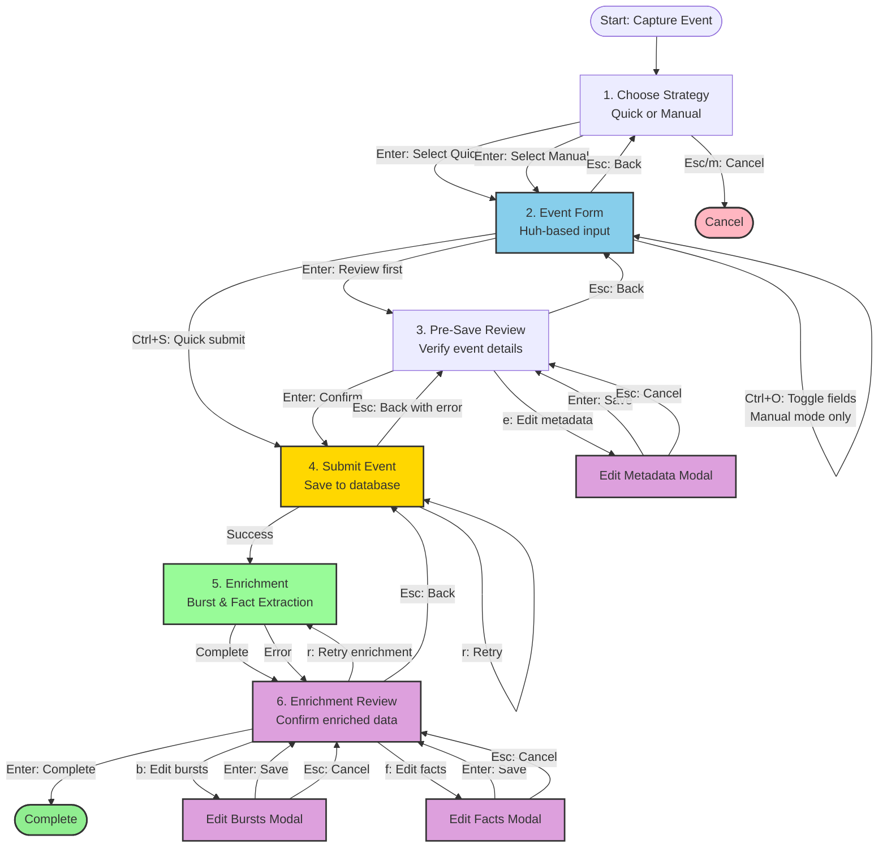

# Event Capture Workflow

**Complete Guide to Capturing Career Events with Burst and Fact Extraction**

**Last Updated**: 2026-01-14
**Workflow Complexity**: High (6 states + 3 modal sub-flows)
**Implementation**: `internal/cli/intents/capture_event_intent.go`

---

## Table of Contents

1. [Overview](#overview)
2. [Workflow States & Navigation](#workflow-states--navigation)
3. [Step-by-Step Guide](#step-by-step-guide)
4. [Actual vs Ideal Workflow](#actual-vs-ideal-workflow)
5. [Complete Keyboard Reference](#complete-keyboard-reference)
6. [Modal Sub-Flows](#modal-sub-flows)
7. [Common Workflows](#common-workflows)
8. [Troubleshooting](#troubleshooting)
9. [Technical Details](#technical-details)

---

## Overview

### What This Workflow Does

Capture career events (achievements, projects, responsibilities) with:
- **Two capture modes**: Quick (minimal fields) or Manual (all fields)
- **Huh forms integration**: Professional form handling with validation
- **Automatic enrichment**: Burst suggestion and fact extraction after save
- **Flexible date parsing**: Natural language ("today", "7 days ago") or ISO format
- **Async submission**: Background processing with progress indication

### When to Use

- Adding new career achievements to your journal
- Capturing project outcomes immediately after completion
- Backfilling past experiences
- Importing events from existing CVs or notes

### Prerequisites

- KaRiya installed and configured
- Database initialized (automatic on first run)
- Optional: Understanding of bursts and facts (see [Burst & Fact Extraction Guide](../BURST_FACT_EXTRACTION_GUIDE.md))

---

## Workflow States & Navigation

### State Machine Diagram



**Diagram Location**: `docs/workflows/diagrams/event_capture_flow.mermaid` (generated by script)

### State Summary Table

| # | State | Type | Can Go Back | Modals |
|---|-------|------|-------------|--------|
| 1 | ChooseStrategy | Root | No (cancels) | No |
| 2 | Form | Intermediate | Yes | No |
| 3 | Pre-Save Review | Intermediate | Yes | Yes (1 - metadata only) |
| 4 | Submit | Async | Yes (with error) | No |
| 5 | Enrichment | Async | No (wait for completion) | No |
| 6 | Enrichment Review | Intermediate | Yes | Yes (2 - bursts & facts) |

---

## Step-by-Step Guide

### Step 1: Choose Strategy

**What it shows**: Selection between Quick and Manual capture modes

**Screen**:
```
┌────────────────────────────────────────────────────────────┐
│ KaRiya > Main Menu > Capture Event > Choose Strategy       │
├────────────────────────────────────────────────────────────┤
│                                                            │
│  Choose Capture Strategy                                   │
│                                                            │
│  ▶  Quick Capture        Minimal fields (text + date)     │
│     Manual Capture       All fields with optional toggle  │
│                                                            │
│  Quick: Fast event entry, review later                    │
│  Manual: Complete event details upfront                   │
│                                                            │
├────────────────────────────────────────────────────────────┤
│ ↑/k ↓/j Navigate  Enter Select  Esc Cancel  m Main  q Quit│
└────────────────────────────────────────────────────────────┘
```

**Keyboard Shortcuts**:
| Key | Action | Result |
|-----|--------|--------|
| `↑` or `k` | Navigate up | Move to Quick |
| `↓` or `j` | Navigate down | Move to Manual |
| `Enter` | Select | Proceed to event form |
| `Esc` or `m` | Cancel | Return to main menu |
| `q` | Quit | Exit application |

**Decision Points**:
- **Quick**: Use when capturing events during busy work sessions
- **Manual**: Use when you have full context and want complete records

---

### Step 2: Event Form

**What it shows**: Huh-based form for event entry

**Screen (Quick Mode)**:
```
┌────────────────────────────────────────────────────────────┐
│ KaRiya > Main Menu > Capture Event > Form                  │
├────────────────────────────────────────────────────────────┤
│                                                            │
│  Capture Career Event (Quick Mode)                        │
│                                                            │
│  Event Text *                                              │
│  ┌────────────────────────────────────────────────────────┐│
│  │ Led platform migration to Ruby 3.1, improving...       ││
│  └────────────────────────────────────────────────────────┘│
│  1,247/2,000 characters                                    │
│                                                            │
│  Date *                                                    │
│  ┌────────────────────┐                                    │
│  │ today              │  (e.g., "today", "7 days ago")    │
│  └────────────────────┘                                    │
│                                                            │
│  [ Review ]  [ Submit ]  [ Cancel ]                        │
│                                                            │
├────────────────────────────────────────────────────────────┤
│ Tab Next  Enter Review/Submit  Ctrl+S Quick Submit        │
│ Esc Cancel  ? Help  m Main  q Quit                        │
└────────────────────────────────────────────────────────────┘
```

**Screen (Manual Mode)**:
```
┌────────────────────────────────────────────────────────────┐
│ KaRiya > Main Menu > Capture Event > Form                  │
├────────────────────────────────────────────────────────────┤
│                                                            │
│  Capture Career Event (Manual Mode)                       │
│                                                            │
│  Event Text *                                              │
│  ┌────────────────────────────────────────────────────────┐│
│  │ Led platform migration to Ruby 3.1...                  ││
│  └────────────────────────────────────────────────────────┘│
│                                                            │
│  Date *          Company           Project                │
│  ┌──────────┐   ┌─────────────┐   ┌─────────────┐        │
│  │ today    │   │ Acme Corp   │   │ Migration   │        │
│  └──────────┘   └─────────────┘   └─────────────┘        │
│                                                            │
│  Tags                           Categories                │
│  ☑ Technical  ☐ Leadership      ☑ Achievement            │
│  ☐ Mentoring  ☐ Product         ☐ Project                │
│                                                            │
│  [ Review ]  [ Submit ]  [ Cancel ]                        │
│                                                            │
├────────────────────────────────────────────────────────────┤
│ Tab Next  Ctrl+O Toggle Optional  Ctrl+S Submit           │
│ Space Toggle  Esc Cancel  ? Help  m Main  q Quit          │
└────────────────────────────────────────────────────────────┘
```

**Keyboard Shortcuts**:
| Key | Action | Result |
|-----|--------|--------|
| `Tab` | Next field | Move to next input |
| `Shift+Tab` | Previous field | Move to previous input |
| `Enter` | Review/Submit | Via button (Huh handles) |
| `Ctrl+S` | Quick submit | Skip Review, go directly to Submit |
| `Ctrl+O` | Toggle fields | Show/hide optional fields (Manual only) |
| `Space` | Toggle | Select/deselect tags/categories |
| `Esc` | Cancel | Return to strategy selection |
| `m` | Main menu | Return to main menu |
| `q` | Quit | Exit application |

**Field Details**:

**Event Text** (required):
- Max 2,000 characters
- Real-time character count
- Supports multi-line input
- Validation: Non-empty

**Date** (required):
- Supports natural language: "today", "yesterday", "7 days ago", "2 weeks ago", "1 month ago"
- Supports ISO format: "2024-01-12", "2024-01-12T14:30:00"
- Validation: Must parse to valid date, cannot be future
- Default: "today"

**Company** (optional, Manual mode):
- Max 200 characters
- Free text input

**Project** (optional, Manual mode):
- Max 200 characters
- Free text input

**Tags** (optional, Manual mode):
- Multiple selection
- Available: Technical, Leadership, Mentoring, Product, Research, Consulting
- Toggle with Space key

**Categories** (optional, Manual mode):
- Multiple selection
- Available: Achievement, Project, Research, Mentoring
- Toggle with Space key

**Form Behavior**:
- Quick mode: Only event text + date visible
- Manual mode: All fields visible, optional fields can be hidden with `Ctrl+O`
- Edit mode: All fields shown, pre-populated with existing event data
- Validation happens on submit

---

### Step 3: Pre-Save Review

**What it shows**: Event preview before submission (metadata verification)

**Screen**:
```
┌────────────────────────────────────────────────────────────┐
│ KaRiya > Main Menu > Capture Event > Pre-Save Review      │
├────────────────────────────────────────────────────────────┤
│                                                            │
│  Review Career Event                                       │
│                                                            │
│  Event: Led platform migration to Ruby 3.1, improving...  │
│  Date: 2024-01-07                                         │
│  Company: Acme Corp                                       │
│  Project: Platform Migration                              │
│  Tags: [Technical] [Achievement]                          │
│                                                            │
│  Verify your event details before submitting.             │
│  Enrichment (burst & fact extraction) will happen after   │
│  the event is saved.                                      │
│                                                            │
│  [ Confirm ]  [ Edit Metadata ]  [ Cancel ]               │
│                                                            │
├────────────────────────────────────────────────────────────┤
│ Enter Confirm  e Edit Metadata  Esc Back  m Main  q Quit  │
└────────────────────────────────────────────────────────────┘
```

**Keyboard Shortcuts**:
| Key | Action | Result |
|-----|--------|--------|
| `Enter` | Confirm | Submit event to database |
| `e` | Edit metadata | Open metadata editor modal |
| `Esc` | Back | Return to form |
| `m` | Main menu | Return to main menu |
| `q` | Quit | Exit application |

**What Happens in Pre-Save Review**:
1. Event data displayed for final verification
2. User can edit metadata (date, company, project, tags)
3. No bursts or facts shown yet (enrichment happens after save)
4. User confirms to proceed to submission

**Note**: This is for verifying event **metadata** only. Bursts and facts will be extracted after the event is saved, in the Enrichment Review step.

---

### Step 4: Submit

**What it shows**: Submission progress and result

**Screen (Submitting)**:
```
┌────────────────────────────────────────────────────────────┐
│ KaRiya > Main Menu > Capture Event > Submit                │
├────────────────────────────────────────────────────────────┤
│                                                            │
│                                                            │
│                     ⏳ Saving Event...                     │
│                                                            │
│              Please wait while we save your event          │
│                                                            │
│                                                            │
├────────────────────────────────────────────────────────────┤
│ Esc Let save complete  m Main Menu  q Quit                │
└────────────────────────────────────────────────────────────┘
```

**Screen (Success)**:
```
┌────────────────────────────────────────────────────────────┐
│ KaRiya > Main Menu > Capture Event > Submit                │
├────────────────────────────────────────────────────────────┤
│                                                            │
│  ✅ Event Saved Successfully!                              │
│                                                            │
│  Event ID: evt_20240112_142345                            │
│  Date: 2024-01-07                                         │
│  Bursts: 1 linked                                         │
│  Facts: 3 inferred                                        │
│                                                            │
│  Your career event has been saved to your journal.        │
│                                                            │
├────────────────────────────────────────────────────────────┤
│ Enter Continue  m Main Menu  q Quit                       │
└────────────────────────────────────────────────────────────┘
```

**Screen (Error)**:
```
┌────────────────────────────────────────────────────────────┐
│ KaRiya > Main Menu > Capture Event > Submit                │
├────────────────────────────────────────────────────────────┤
│                                                            │
│  ❌ Failed to Save Event                                   │
│                                                            │
│  Error: Database connection failed                        │
│                                                            │
│  Please check your database configuration and try again.  │
│                                                            │
│                                                            │
├────────────────────────────────────────────────────────────┤
│ r Retry  Esc Back to Review  m Main Menu  q Quit          │
└────────────────────────────────────────────────────────────┘
```

**Keyboard Shortcuts**:
| Key | Action | Result |
|-----|--------|--------|
| `Enter` | Continue | Complete workflow (on success) |
| `r` | Retry | Retry submission (on error) |
| `Esc` | Back | Return to Review with error visible |
| `m` | Main menu | Return to main menu |
| `q` | Quit | Exit application |

**What Happens**:
1. Event validated
2. Saved to database via CLIEventService
3. Success modal displayed (auto-dismiss after 3s)
4. Proceeds to Enrichment step

---

### Step 5: Enrichment

**What it shows**: Automatic burst and fact extraction progress

**Screen (Enriching)**:
```
┌────────────────────────────────────────────────────────────┐
│ KaRiya > Main Menu > Capture Event > Enrichment            │
├────────────────────────────────────────────────────────────┤
│                                                            │
│                                                            │
│                  ⏳ Enriching Event...                     │
│                                                            │
│         Extracting bursts and facts from your event        │
│                                                            │
│                                                            │
├────────────────────────────────────────────────────────────┤
│ Please wait...                                             │
└────────────────────────────────────────────────────────────┘
```

**Screen (Enrichment Error)**:
```
┌────────────────────────────────────────────────────────────┐
│ KaRiya > Main Menu > Capture Event > Enrichment            │
├────────────────────────────────────────────────────────────┤
│                                                            │
│  ⚠️  Enrichment Warning                                    │
│                                                            │
│  Unable to extract bursts/facts automatically.            │
│  You can still complete the workflow.                     │
│                                                            │
│  Error: Service temporarily unavailable                   │
│                                                            │
├────────────────────────────────────────────────────────────┤
│ Enter Continue  r Retry Enrichment                         │
└────────────────────────────────────────────────────────────┘
```

**Keyboard Shortcuts**:
| Key | Action | Result |
|-----|--------|--------|
| N/A | Wait | Enrichment runs automatically |

**What Happens**:
1. System groups related events → Suggests bursts
2. System infers competencies, role fit, audience → Extracts facts
3. Results passed to Enrichment Review state
4. If enrichment fails, proceeds with empty results (user can retry later)

**Note**: This is an **automatic** step based on **PRD_MASTER.md Section 7**. User waits for completion.

---

### Step 6: Enrichment Review

**What it shows**: Enriched data for user confirmation

**Screen (With Enriched Data)**:
```
┌────────────────────────────────────────────────────────────┐
│ KaRiya > Main Menu > Capture Event > Enrichment Review    │
├────────────────────────────────────────────────────────────┤
│                                                            │
│  ✅ Event Saved - Review Enriched Data                     │
│                                                            │
│  Event: Led platform migration to Ruby 3.1...             │
│  Date: 2024-01-07                                         │
│  Company: Acme Corp                                       │
│                                                            │
│  ─────────────────────────────────────────────────────    │
│                                                            │
│  Inferred Bursts (2)                                       │
│  ☑ Platform Modernization (3 events)                     │
│  ☑ Ruby 3.x Adoption (5 events)                           │
│                                                            │
│  Inferred Facts (3)                                        │
│  • Migration expertise (High confidence)                  │
│  • Performance optimization (Medium confidence)           │
│  • Technical leadership (Medium confidence)               │
│                                                            │
│  [ Complete ]  [ Edit Bursts ]  [ Edit Facts ]            │
│                                                            │
├────────────────────────────────────────────────────────────┤
│ Enter Complete  b Edit Bursts  f Edit Facts  r Retry      │
│ Esc Back  m Main  q Quit                                   │
└────────────────────────────────────────────────────────────┘
```

**Screen (No Enrichment Results)**:
```
┌────────────────────────────────────────────────────────────┐
│ KaRiya > Main Menu > Capture Event > Enrichment Review    │
├────────────────────────────────────────────────────────────┤
│                                                            │
│  ✅ Event Saved                                            │
│                                                            │
│  Event: Led platform migration to Ruby 3.1...             │
│  Date: 2024-01-07                                         │
│                                                            │
│  ─────────────────────────────────────────────────────    │
│                                                            │
│  No bursts or facts extracted.                            │
│  This may be your first event, or enrichment is not      │
│  available. You can add bursts/facts later via Browse.   │
│                                                            │
│  [ Complete ]  [ Retry Enrichment ]                        │
│                                                            │
├────────────────────────────────────────────────────────────┤
│ Enter Complete  r Retry Enrichment  Esc Back  m Main      │
└────────────────────────────────────────────────────────────┘
```

**Keyboard Shortcuts**:
| Key | Action | Result |
|-----|--------|--------|
| `Enter` | Complete | Finish workflow, return to main menu |
| `b` | Edit bursts | Open burst editor modal |
| `f` | Edit facts | Open fact editor modal |
| `r` | Retry enrichment | Go back to Enrichment step |
| `↑` or `k` | Navigate up | Move through bursts/facts |
| `↓` or `j` | Navigate down | Move through bursts/facts |
| `Esc` | Back | Return to Submit (show success modal) |
| `m` | Main menu | Return to main menu |
| `q` | Quit | Exit application |

**What Happens in Enrichment Review**:
1. Event summary displayed with enriched data
2. Inferred bursts shown (groups of related events)
3. Inferred facts shown (competencies, role fit, audience relevance)
4. User can edit bursts/facts via modals ('b' and 'f' keys)
5. User confirms to complete workflow

**Note**: This is where burst and fact editing happens. The 'b' and 'f' keys work **only in this state**, not in Pre-Save Review.

---

## Workflow Paths

Based on **PRD_MASTER.md Section 7 & 9a**, the CaptureEvent workflow follows these paths:

### Standard Path (Recommended)

```
Choose Strategy → Form → Pre-Save Review → Submit → Save → 
    Enrichment → Enrichment Review → Complete
```

**Duration**: ~2-3 minutes per event  
**Use case**: Normal event capture with full verification

### Quick Submit Path (Skip Pre-Save Review)

```
Choose Strategy → Form → Ctrl+S → Submit → Save → 
    Enrichment → Enrichment Review → Complete
```

**Duration**: ~1-2 minutes per event  
**Use case**: Rapid event capture when metadata is already correct

### Full Path (With Pre-Save Metadata Editing)

```
Choose Strategy → Form → Pre-Save Review → Edit Metadata → 
    Pre-Save Review → Submit → Save → Enrichment → 
    Enrichment Review → Complete
```

**Duration**: ~3-4 minutes per event  
**Use case**: Detailed event capture with metadata corrections

### Full Path (With Post-Save Burst/Fact Editing)

```
Choose Strategy → Form → Pre-Save Review → Submit → Save → 
    Enrichment → Enrichment Review → Edit Bursts → 
    Enrichment Review → Edit Facts → Enrichment Review → Complete
```

**Duration**: ~3-5 minutes per event  
**Use case**: Event capture with manual burst/fact refinement

---

## Key Workflow Principles

1. **Pre-Save Review** (Step 3) is for verifying **event metadata** BEFORE save
   - Shows: Event text, date, company, project, tags
   - Does NOT show: Bursts or facts (not extracted yet)
   - Keys: `e` for metadata editing, `Enter` to submit

2. **Enrichment** (Step 5) is **AUTOMATIC** after successful save
   - System suggests bursts (groups of related events)
   - System extracts facts (competencies, role fit, audience)
   - User cannot skip this step (but it proceeds even on error)

3. **Enrichment Review** (Step 6) is for confirming **enriched data** AFTER save
   - Shows: Inferred bursts and facts
   - Keys: `b` for burst editing, `f` for fact editing
   - User reviews and optionally edits before completing

4. **Ctrl+S from Form** skips pre-save review but NOT enrichment or enrichment review

5. **Enrichment errors** are non-fatal:
   - User sees warning but can proceed
   - Empty bursts/facts shown in Enrichment Review
   - User can retry enrichment with 'r' key

---

## Complete Keyboard Reference

### Universal Shortcuts (All States)

| Key | Action | Works In |
|-----|--------|----------|
| `q` | Quit application | All states |
| `m` | Main menu | All states |
| `Ctrl+C` | Force quit | All states |

### State-Specific Shortcuts

#### Choose Strategy

| Key | Action |
|-----|--------|
| `↑` or `k` | Navigate up |
| `↓` or `j` | Navigate down |
| `Enter` | Select strategy |
| `Esc` | Cancel (return to main menu) |

#### Event Form

| Key | Action |
|-----|--------|
| `Tab` | Next field |
| `Shift+Tab` | Previous field |
| `Enter` | Review/Submit (via button) |
| `Ctrl+S` | Quick submit (skip Review) |
| `Ctrl+O` | Toggle optional fields (Manual only) |
| `Space` | Toggle checkbox (tags/categories) |
| `Esc` | Cancel (return to strategy) |

#### Review

| Key | Action |
|-----|--------|
| `Ctrl+S` or `Enter` | Confirm and submit |
| `e` | Edit metadata (modal) |
| `b` | Edit bursts (modal) |
| `f` | Edit facts (modal) |
| `a` | Accept selected burst/fact |
| `r` | Reject selected burst/fact |
| `↑` or `k` | Navigate up |
| `↓` or `j` | Navigate down |
| `Esc` | Back to form |

#### Submit

| Key | Action |
|-----|--------|
| `Enter` | Continue (on success) |
| `r` | Retry (on error) |
| `Esc` | Back to Review |

---

## Modal Sub-Flows

### Edit Metadata Modal

**Purpose**: Edit event metadata (date, company, project, tags, categories)

**Trigger**: Press `e` in Review state

**Fields**:
- Date (with date parsing)
- Company
- Project
- Tags (multi-select)
- Categories (multi-select)

**Shortcuts**:
- `Tab` / `Shift+Tab`: Navigate fields
- `Space`: Toggle checkboxes
- `Enter`: Save changes and return to Review
- `Esc`: Cancel changes and return to Review

---

### Edit Bursts Modal

**Purpose**: Accept/reject/edit burst suggestions

**Trigger**: Press `b` in Review state

**What it shows**:
- List of suggested bursts based on similar events
- Burst name and event count
- Checkbox to accept/reject

**Shortcuts**:
- `↑` or `k`: Navigate up
- `↓` or `j`: Navigate down
- `Space`: Toggle burst acceptance
- `a`: Accept all bursts
- `r`: Reject all bursts
- `Enter`: Save selections and return to Review
- `Esc`: Cancel and return to Review

---

### Edit Facts Modal

**Purpose**: Review and edit inferred facts

**Trigger**: Press `f` in Review state

**What it shows**:
- Inferred competencies (e.g., "Migration expertise")
- Role fit scores (Principal, Staff, EM, Senior IC)
- Audience relevance (Hiring Manager, Recruiter, Peer)
- Confidence levels (High, Medium, Low)

**Shortcuts**:
- `↑` or `k`: Navigate up
- `↓` or `j`: Navigate down
- `Space`: Toggle fact acceptance
- `e`: Edit fact details (future)
- `Enter`: Save changes and return to Review
- `Esc`: Cancel and return to Review

---

## Common Workflows

### Workflow 1: Quick Capture (Minimal)

**Goal**: Capture event as fast as possible

**Steps**:
1. `c` (from main menu)
2. `Enter` (select Quick)
3. Type event text
4. `Tab`
5. Type date (or leave as "today")
6. `Ctrl+S` (quick submit, skip Review)
7. `Enter` (continue after success)

**Time**: ~20 seconds

---

### Workflow 2: Manual Capture with Full Details

**Goal**: Capture event with all metadata upfront

**Steps**:
1. `c`
2. `↓` `Enter` (select Manual)
3. Type event text
4. `Tab` → date
5. `Tab` → company
6. `Tab` → project
7. `Tab` → tags → `Space` `Space` (select tags)
8. `Tab` → categories → `Space` (select category)
9. `Tab` `Tab` `Enter` (Review button)
10. `Ctrl+S` (submit from Review)
11. `Enter` (continue)

**Time**: ~45 seconds

---

### Workflow 3: Capture with Burst Linking

**Goal**: Capture event and link to existing burst

**Steps**:
1. `c`
2. `Enter` (Quick)
3. Type event text
4. `Tab` → date
5. `Enter` (Review)
6. `b` (edit bursts)
7. `Space` (accept suggested burst)
8. `Enter` (save burst selection)
9. `Ctrl+S` (submit)
10. `Enter` (continue)

**Time**: ~35 seconds

---

### Workflow 4: Capture with Full Enrichment

**Goal**: Capture event with metadata, bursts, and facts

**Steps**:
1. `c` → `↓` `Enter` (Manual)
2. Fill all fields
3. `Enter` (Review)
4. `e` → Edit metadata → `Enter`
5. `b` → Accept bursts → `Enter`
6. `f` → Review facts → `Enter`
7. `Ctrl+S` (submit)
8. `Enter` (continue)

**Time**: ~60 seconds

---

## Troubleshooting

### Date Parsing Fails

**Symptoms**: "Invalid date" error when submitting

**Causes**:
- Unrecognized date format
- Future date entered
- Typo in natural language date

**Solutions**:
1. Use ISO format: `2024-01-12`
2. Use supported natural language: "today", "yesterday", "7 days ago", "2 weeks ago", "1 month ago"
3. Check for typos: "todya" → "today"
4. Ensure date is not in the future

**Supported formats**:
- `today` → current date
- `yesterday` → 1 day ago
- `7 days ago` → 7 days ago
- `2 weeks ago` → 14 days ago
- `1 month ago` → ~30 days ago
- `2024-01-12` → specific date
- `2024-01-12T14:30:00` → specific date and time

---

### Form Validation Fails

**Symptoms**: Cannot submit form, red error text

**Causes**:
- Required field empty (event text or date)
- Text exceeds 2,000 characters
- Invalid date format

**Solutions**:
1. Fill required fields (marked with *)
2. Reduce event text to ≤2,000 characters
3. Fix date format (see above)
4. Check for validation messages in red

---

### Bursts/Facts Not Appearing

**Symptoms**: Review shows no burst/fact suggestions

**Causes**:
- First event in system (no similar events)
- Event text too short for fact extraction
- Fact extraction disabled in config

**Solutions**:
1. Capture more events first (bursts need ≥2 similar events)
2. Add more detail to event text (≥100 characters recommended)
3. Check config: fact extraction enabled
4. Note: Bursts/facts are optional, you can proceed without them

---

### Save Fails

**Symptoms**: "Failed to Save Event" error

**Causes**:
- Database connection issue
- Disk full
- Permission denied
- Invalid event data

**Solutions**:
1. Check database connection: `make test`
2. Check disk space: `df -h`
3. Check permissions on `~/.kariya/` directory
4. Retry with `r` key
5. Return to Review and check data validity
6. Restart application if persistent

---

## Technical Details

### Huh Forms Integration

Event form uses Charm's **huh** library:

```go
form := huh.NewForm(
    huh.NewGroup(
        huh.NewText().
            Key("text").
            Title("Event Text").
            Validate(validators.RequiredText).
            CharLimit(2000),
        
        huh.NewText().
            Key("date").
            Title("Date").
            Validate(validators.ParseDateString),
    ),
)
```

**Benefits**:
- Automatic focus management
- Built-in validation
- Professional Catppuccin theming
- Type-safe field access
- 70% less code vs manual textinput arrays

**See**: [Huh Forms Guide](../HUH_FORMS_GUIDE.md)

---

### Date Parsing Implementation

**Function**: `validators.ParseDateString()`

**Supported formats**:
- Relative: "today", "yesterday", "X days ago", "X weeks ago", "X months ago"
- ISO: "2024-01-12", "2024-01-12T14:30:00Z"

**Returns**: `time.Time` or error

---

### Async Submission

**Pattern**:
```go
func (i *CaptureEventIntent) performSubmit() tea.Cmd {
    return func() tea.Msg {
        err := i.cliService.CaptureEvent(
            i.eventData.Text,
            i.eventData.Date,
            i.eventData.Company,
            i.eventData.Project,
            i.eventData.Tags,
            i.eventData.Categories,
        )
        if err != nil {
            return SubmitErrorMsg{err}
        }
        return SubmitCompleteMsg{eventID}
    }
}
```

---

### Modal Overlay System

**Implementation**:
```go
// In Review state, modals overlay the base view
if i.editingMode == EditingModeMetadata {
    baseView := i.renderReviewView()
    modal := i.metadataModal.View()
    return renderOverlay(baseView, modal)
}
```

**Modals**:
- `EditMetadataModalNew` (huh form)
- `BurstSuggestionModalNew` (list + checkboxes)
- `FactEditorModalNew` (list + edit)

---

## Related Documentation

- **[CV Generation Workflow](CV_GENERATION_WORKFLOW.md)** - Generate CVs from captured events
- **[Keyboard Shortcuts Guide](../KEYBOARD_SHORTCUTS_GUIDE.md)** - Complete keyboard reference
- **[Huh Forms Guide](../HUH_FORMS_GUIDE.md)** - Form system documentation
- **[Burst & Fact Extraction Guide](../BURST_FACT_EXTRACTION_GUIDE.md)** - Understanding bursts and facts
- **[Metadata Review Guide](../METADATA_REVIEW_GUIDE.md)** - Reviewing and enriching events
- **[PRD Master](../PRD_MASTER.md)** - Product requirements and data model

---

**Document Status**: ✅ Complete and Production-Ready
**Last Updated**: 2026-01-12
**Implementation File**: `internal/cli/intents/capture_event_intent.go`
**Test Coverage**: 30+ tests, 100% passing
**Next Review**: 2026-04-01
