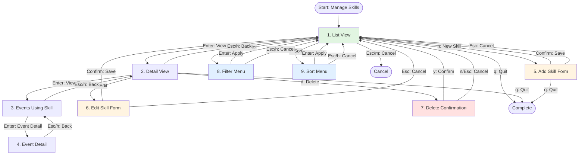

# Manage Skills Workflow

**Complete Guide to Managing User-Defined Skills**

**Last Updated**: 2026-01-14
**Workflow Complexity**: Medium (9 states)
**Pattern Compliance**: 83% (10/12 patterns implemented)
**Implementation**: `internal/cli/intents/manage_skills_intent.go`

---

## Table of Contents

1. [Overview](#overview)
2. [Workflow States & Navigation](#workflow-states--navigation)
3. [Step-by-Step Guide](#step-by-step-guide)
4. [Complete Keyboard Reference](#complete-keyboard-reference)
5. [Navigation Patterns](#navigation-patterns)
6. [Common Workflows](#common-workflows)
7. [Troubleshooting](#troubleshooting)
8. [Technical Details](#technical-details)

---

## Overview

### What This Workflow Does

Manage your professional skills and technology competencies with:
- **Skill catalog**: View all skills organized by category
- **Add/Edit skills**: Create and update skills with name, category, and proficiency level
- **Filter & Sort**: Filter by category or level, sort by name/category/level
- **Event tracking**: See which career events use each skill
- **Delete skills**: Remove skills with confirmation
- **Full navigation**: Intuitive keyboard navigation with back/cancel support

### When to Use

- Adding new technologies or skills you've learned
- Viewing your complete skill inventory
- Tracking which events demonstrate specific skills
- Organizing skills by category or proficiency level
- Cleaning up unused or outdated skills

### Prerequisites

- KaRiya application running
- SQLite database initialized
- No specific data required (works with empty skills list)

---

## Workflow States & Navigation

### State Machine Diagram



### State Overview

| State | Type | Description | Escape Behavior |
|-------|------|-------------|-----------------|
| **List** | Root | Skills list with filter/sort options | Cancel intent |
| **Detail** | View | Single skill details and actions | → List |
| **DetailEvents** | View | Events using this skill | → Detail |
| **DetailEventDetail** | View | Single event detail from events list | → DetailEvents |
| **Add** | Form | Add new skill (huh form) | → List |
| **Edit** | Form | Edit existing skill (huh form) | → List |
| **Delete** | Confirmation | Confirm skill deletion | → List |
| **Filter** | Menu | Filter skills by category/level | → List |
| **Sort** | Menu | Sort skills by name/category/level | → List |

---

## Step-by-Step Guide

### 1. List View (Root State)

**Purpose**: Browse all skills with filtering and sorting

**View Elements**:
- Header with logo and breadcrumbs: "Skills"
- Skills table with columns: Name, Category, Level, Years, Events
- Footer with keyboard shortcuts
- Pagination info (if > page size)
- Empty message if no skills

**Available Actions**:
| Key | Action | Next State |
|-----|--------|-----------|
| `↑/↓` or `j/k` | Navigate through skills | List |
| `Enter` or `l` | View skill details | Detail |
| `n` | Add new skill | Add |
| `f` | Open filter menu | Filter |
| `s` | Open sort menu | Sort |
| `/` | Search skills | List |
| `x` | Clear filters (if active) | List |
| `Esc` | Cancel/return to main menu | Main Menu |
| `q` | Quit application | Exit |
| `m` | Return to main menu | Main Menu |
| `?` or `h` | Toggle help | List |

**Example View**:
```
                              Skills                              

  Name                 Category       Level        Years   Events  
 ────────────────────────────────────────────────────────────────
  ▶ Go                 backend        expert       -       12     
   React               frontend       advanced     -       8      
   PostgreSQL          database       intermediate -       15     
   Docker              devops         advanced     -       10     
   Kubernetes          devops         beginner     -       2      

Skills: 5 | Page 1 of 1

──────────────────────────────────────────────────────────────────
 ↑/↓  Navigate   Enter  View details   n  New skill   f  Filter   
 s  Sort   q  Quit   m  Main Menu
```

---

### 2. Detail View

**Purpose**: View detailed information about a single skill

**View Elements**:
- Breadcrumbs: "Skills ▸ [Skill Name]"
- Skill details card:
  - Name
  - Category
  - Proficiency Level
  - Event Count (number of events using this skill)
  - Created/Updated timestamps
- Footer with actions

**Available Actions**:
| Key | Action | Next State |
|-----|--------|-----------|
| `Enter` | View events using this skill | DetailEvents |
| `e` | Edit this skill | Edit |
| `d` | Delete this skill | Delete |
| `Esc` or `h` | Back to list | List |
| `q` | Quit application | Exit |
| `m` | Return to main menu | Main Menu |
| `?` | Toggle help | Detail |

**Example View**:
```
                        Skills  ▸  Go                        

              ╭───────────────────────────────────╮           
              │                                   │           
              │  Name:          Go                │           
              │  Category:      backend           │           
              │  Level:         expert            │           
              │  Event Count:   12                │           
              │                                   │           
              │  Created:       2026-01-05 14:30  │           
              │  Updated:       2026-01-12 09:15  │           
              │                                   │           
              ╰───────────────────────────────────╯           

──────────────────────────────────────────────────────────────
 Esc  Back   Enter  View events   e  Edit   d  Delete   
 q  Quit   m  Main Menu
```

---

### 3. Events Using Skill View

**Purpose**: See which career events demonstrate this skill

**View Elements**:
- Breadcrumbs: "Skills ▸ [Skill Name] ▸ Events"
- Events table with columns: Date, Company, Event
- Event count
- Empty message if no events use this skill
- Footer with navigation

**Available Actions**:
| Key | Action | Next State |
|-----|--------|-----------|
| `↑/↓` or `j/k` | Navigate through events | DetailEvents |
| `Enter` | View event details | DetailEventDetail |
| `Esc` or `h` | Back to skill detail | Detail |
| `q` | Quit application | Exit |
| `m` | Return to main menu | Main Menu |
| `?` | Toggle help | DetailEvents |

**Example View**:
```
                   Skills  ▸  Go  ▸  Events                   

  Date         Company         Event                           
 ──────────────────────────────────────────────────────────────
  ▶ 2026-01-10  TechCorp        Migrated API to Go microservices
   2026-01-05  TechCorp        Implemented Go service layer    
   2025-12-20  TechCorp        Built CLI tool in Go            

Events using this skill: 3

──────────────────────────────────────────────────────────────
 ↑/↓  Navigate   Enter  View details   Esc  Back   q  Quit   
 m  Main Menu
```

---

### 4. Event Detail View (from Skills)

**Purpose**: View full details of an event that uses this skill

**View Elements**:
- Breadcrumbs: "Skills ▸ [Skill Name] ▸ Events ▸ Detail"
- Event detail card with full information
- Skills/tags/categories
- Footer with navigation

**Available Actions**:
| Key | Action | Next State |
|-----|--------|-----------|
| `Esc` or `h` | Back to events list | DetailEvents |
| `q` | Quit application | Exit |
| `m` | Return to main menu | Main Menu |
| `?` | Toggle help | DetailEventDetail |

---

### 5. Add Skill Form

**Purpose**: Create a new skill

**View Elements**:
- Breadcrumbs: "Skills ▸ Add"
- Huh form with fields:
  - **Skill Name** (required, text input)
  - **Category** (select: backend, frontend, devops, database, cloud, mobile, tooling, other)
  - **Proficiency Level** (select: beginner, intermediate, advanced, expert)
  - **Years of Experience** (optional, number input 0-50)
- Footer with form actions

**Form Fields**:

1. **Skill Name** (required)
   - Text input
   - Validation: 1-100 characters, non-empty
   - Example: "Go", "React", "PostgreSQL"

2. **Category** (required)
   - Select list
   - Options: backend, frontend, devops, database, cloud, mobile, tooling, other
   - Can also enter custom category

3. **Proficiency Level** (optional)
   - Select list
   - Options: beginner, intermediate, advanced, expert
   - Leave empty if not applicable

4. **Years of Experience** (optional)
   - Number input (0-50)
   - Leave empty if unknown

**Available Actions**:
| Key | Action | Next State |
|-----|--------|-----------|
| `Tab` | Next field | Add |
| `Shift+Tab` | Previous field | Add |
| `↑/↓` | Navigate select options | Add |
| `Enter` | Submit form (when on confirm button) | List |
| `Esc` | Cancel and discard | List |
| `q` | Quit application | Exit |
| `?` | Toggle help | Add |

**Validation**:
- Skill name must not be empty
- Skill name must be unique (case-insensitive)
- Years must be 0-50 if provided

**Example View**:
```
                        Skills  ▸  Add                        

  ┃ Skill Name                                                  
  ┃ Name of the skill or technology (required)                 
  ┃ > _                                                         
                                                                
    Category                                                    
    Skill category or domain                                    
    > backend                                                   
      frontend                                                  
      devops                                                    
      database                                                  
                                                                
    Proficiency Level                                           
    Your proficiency level (optional)                           
    >                                                           
      beginner                                                  
      intermediate                                              
      advanced                                                  
      expert                                                    

──────────────────────────────────────────────────────────────
 Tab  Next field   Enter  Submit   Esc  Cancel   q  Quit
```

---

### 6. Edit Skill Form

**Purpose**: Modify an existing skill

**View Elements**:
- Breadcrumbs: "Skills ▸ [Skill Name] ▸ Edit"
- Huh form with pre-filled fields (same as Add form)
- Footer with form actions

**Available Actions**: Same as Add form

**Differences from Add**:
- Fields are pre-populated with existing values
- Skill name uniqueness validated excluding current skill
- Saving updates existing skill instead of creating new one

**Example View**:
```
                     Skills  ▸  Go  ▸  Edit                    

  ┃ Skill Name                                                  
  ┃ Name of the skill or technology (required)                 
  ┃ > Go                                                        
                                                                
    Category                                                    
    Skill category or domain                                    
    > backend                                                   
      frontend                                                  
      devops                                                    
                                                                
    Proficiency Level                                           
    Your proficiency level (optional)                           
    > expert                                                    
      beginner                                                  
      intermediate                                              
      advanced                                                  

──────────────────────────────────────────────────────────────
 Tab  Next field   Enter  Submit   Esc  Cancel   q  Quit
```

---

### 7. Delete Confirmation

**Purpose**: Confirm skill deletion

**View Elements**:
- Breadcrumbs: "Skills ▸ [Skill Name] ▸ Delete"
- Confirmation message showing skill name
- Warning about associated events (if any)
- Yes/No prompt
- Footer with actions

**Available Actions**:
| Key | Action | Next State |
|-----|--------|-----------|
| `y` | Confirm deletion | List |
| `n` or `Esc` | Cancel deletion | List |
| `q` | Quit application | Exit |
| `?` | Toggle help | Delete |

**Example View**:
```
                     Skills  ▸  Go  ▸  Delete                   

              ╭───────────────────────────────────╮           
              │                                   │           
              │  Delete Skill: Go                 │           
              │                                   │           
              │  Are you sure you want to delete  │           
              │  this skill?                      │           
              │                                   │           
              │  This skill is used in 12 events. │           
              │  Event associations will be       │           
              │  removed.                         │           
              │                                   │           
              ╰───────────────────────────────────╯           

──────────────────────────────────────────────────────────────
 y  Confirm   n  Cancel   Esc  Back   q  Quit   m  Main Menu
```

---

### 8. Filter Menu

**Purpose**: Filter skills by category or proficiency level

**View Elements**:
- Breadcrumbs: "Skills ▸ Filter"
- Filter options menu:
  - All Skills (clear filter)
  - By Category: backend, frontend, devops, database, cloud, mobile, tooling, other
  - By Level: beginner, intermediate, advanced, expert
- Current filter indicator (if active)
- Footer with navigation

**Available Actions**:
| Key | Action | Next State |
|-----|--------|-----------|
| `↑/↓` or `j/k` | Navigate filter options | Filter |
| `Enter` | Apply selected filter | List |
| `Esc` or `h` | Cancel and return | List |
| `q` | Quit application | Exit |
| `?` | Toggle help | Filter |

**Filter Types**:
1. **All Skills**: Remove any active filter
2. **Category Filter**: Show only skills in selected category
3. **Level Filter**: Show only skills with selected proficiency level

**Example View**:
```
                       Skills  ▸  Filter                       

              ╭───────────────────────────────────╮           
              │                                   │           
              │  ▶ All Skills                     │           
              │                                   │           
              │  By Category:                     │           
              │    backend                        │           
              │    frontend                       │           
              │    devops                         │           
              │    database                       │           
              │    cloud                          │           
              │                                   │           
              │  By Level:                        │           
              │    beginner                       │           
              │    intermediate                   │           
              │    advanced                       │           
              │    expert                         │           
              │                                   │           
              ╰───────────────────────────────────╯           

──────────────────────────────────────────────────────────────
 ↑/↓  Navigate   Enter  Apply   Esc  Cancel   q  Quit
```

---

### 9. Sort Menu

**Purpose**: Sort skills by name, category, or proficiency level

**View Elements**:
- Breadcrumbs: "Skills ▸ Sort"
- Sort options menu:
  - Name (A-Z or Z-A)
  - Category (A-Z or Z-A)
  - Level (beginner→expert or expert→beginner)
  - Most Used (by event count)
- Current sort indicator
- Footer with navigation

**Available Actions**:
| Key | Action | Next State |
|-----|--------|-----------|
| `↑/↓` or `j/k` | Navigate sort options | Sort |
| `Enter` | Apply selected sort | List |
| `Esc` or `h` | Cancel and return | List |
| `q` | Quit application | Exit |
| `?` | Toggle help | Sort |

**Sort Options**:
1. **Name (A-Z)**: Alphabetical by name, ascending
2. **Name (Z-A)**: Alphabetical by name, descending
3. **Category (A-Z)**: By category name, then skill name
4. **Category (Z-A)**: By category name (desc), then skill name
5. **Level (beginner→expert)**: By proficiency level ascending
6. **Level (expert→beginner)**: By proficiency level descending
7. **Most Used**: By event count descending

**Example View**:
```
                        Skills  ▸  Sort                        

              ╭───────────────────────────────────╮           
              │                                   │           
              │  ▶ Name (A-Z)                     │           
              │    Name (Z-A)                     │           
              │    Category (A-Z)                 │           
              │    Category (Z-A)                 │           
              │    Level (beginner→expert)        │           
              │    Level (expert→beginner)        │           
              │    Most Used                      │           
              │                                   │           
              ╰───────────────────────────────────╯           

──────────────────────────────────────────────────────────────
 ↑/↓  Navigate   Enter  Apply   Esc  Cancel   q  Quit
```

---

## Complete Keyboard Reference

### Universal Shortcuts (Work Everywhere)

| Key | Action | Notes |
|-----|--------|-------|
| `Esc` | Go back / Cancel | Context-aware: cancels from root, goes back otherwise |
| `q` | Quit application | Returns `tea.Quit` command |
| `Ctrl+C` | Force quit | Emergency exit |
| `m` | Main menu | Return to main menu from any state |
| `?` or `h` | Toggle help | Shows/hides extended help text |

### List View (Root State)

| Key | Action |
|-----|--------|
| `↑/↓` | Navigate up/down |
| `j/k` | Vim-style navigation (down/up) |
| `Enter` | View skill details |
| `l` | Vim-style forward (same as Enter) |
| `n` | Add new skill |
| `f` | Open filter menu |
| `s` | Open sort menu |
| `/` | Search skills |
| `x` | Clear active filters |
| `Esc` | Cancel/return to main menu |

### Detail View

| Key | Action |
|-----|--------|
| `Enter` | View events using this skill |
| `e` | Edit this skill |
| `d` | Delete this skill |
| `Esc` | Back to list |
| `h` | Vim-style back (same as Esc) |

### Events View

| Key | Action |
|-----|--------|
| `↑/↓` or `j/k` | Navigate through events |
| `Enter` | View event details |
| `Esc` or `h` | Back to skill detail |

### Forms (Add/Edit)

| Key | Action |
|-----|--------|
| `Tab` | Next field |
| `Shift+Tab` | Previous field |
| `↑/↓` | Navigate select options |
| `Enter` | Submit form (when on confirm button) |
| `Esc` | Cancel and discard changes |

### Confirmation Dialogs (Delete)

| Key | Action |
|-----|--------|
| `y` | Confirm action |
| `n` | Cancel action |
| `Esc` | Cancel (same as 'n') |

### Menus (Filter/Sort)

| Key | Action |
|-----|--------|
| `↑/↓` or `j/k` | Navigate options |
| `Enter` | Select and apply option |
| `Esc` or `h` | Cancel and return |

---

## Navigation Patterns

### Forward Navigation

**From List** (root state):
- `Enter` → Detail view
- `n` → Add form
- `f` → Filter menu
- `s` → Sort menu

**From Detail**:
- `Enter` → Events using skill
- `e` → Edit form
- `d` → Delete confirmation

**From Events**:
- `Enter` → Event detail

**From Forms/Menus**:
- `Enter` → Submit/Apply and return to List

### Back Navigation

**General Pattern**: `Esc` or `h` (vim-style)

| From State | Esc Behavior | Preserves Data? |
|------------|--------------|-----------------|
| List (root) | Cancel intent → Main Menu | N/A |
| Detail | → List | N/A |
| DetailEvents | → Detail | N/A |
| DetailEventDetail | → DetailEvents | N/A |
| Add Form | → List (discard) | ❌ No |
| Edit Form | → List (discard) | ❌ No |
| Delete | → List (cancel) | N/A |
| Filter | → List (cancel) | N/A |
| Sort | → List (cancel) | N/A |

**Context Preservation**:
- List scroll position is preserved when returning from Detail
- Filter/Sort settings persist across navigation
- Form data is lost on cancel (by design)

### Error Recovery

**Form Validation Errors**:
- Stay in form state
- Show validation message
- Allow user to correct and resubmit or cancel

**Database Errors**:
- Show error modal
- Stay in current state or return to safe state (List)
- Allow user to retry or cancel

**Empty States**:
- Show helpful empty message
- Offer action to add first skill ("Press 'n' to add your first skill")

---

## Common Workflows

### 1. Add a New Skill

**Steps**: List → Add → List

**Time**: ~30 seconds

**Keyboard Flow**:
```
m → (select Manage Skills) → n → 
Tab → (enter name) → 
Tab → (select category) → 
Tab → (select level) → 
Enter (submit)
```

**Example**:
1. From main menu, select "Manage Skills"
2. Press `n` to open Add form
3. Type "Kubernetes" for skill name
4. Tab to Category, select "devops"
5. Tab to Level, select "intermediate"
6. Tab to confirm button, press Enter
7. Returns to List with new skill visible

---

### 2. View Skill Details and Events

**Steps**: List → Detail → Events → Detail → List

**Time**: ~1 minute

**Keyboard Flow**:
```
m → (select Manage Skills) → 
j/k (select skill) → Enter → 
Enter (view events) → 
j/k (select event) → Enter (view detail) → 
Esc → Esc → Esc
```

**Example**:
1. Navigate to "Go" skill in list
2. Press Enter to view details
3. Press Enter again to view events using Go
4. Navigate through events and view details
5. Press Esc three times to return to List

---

### 3. Filter Skills by Category

**Steps**: List → Filter → List

**Time**: ~15 seconds

**Keyboard Flow**:
```
m → (select Manage Skills) → f → 
j/k (select category) → Enter
```

**Example**:
1. From skills list, press `f`
2. Navigate to "backend" category
3. Press Enter to apply filter
4. List now shows only backend skills
5. Press `x` to clear filter when done

---

### 4. Edit Existing Skill

**Steps**: List → Detail → Edit → List

**Time**: ~45 seconds

**Keyboard Flow**:
```
m → (select Manage Skills) → 
j/k (select skill) → Enter → e → 
Tab → (modify fields) → 
Enter (submit)
```

**Example**:
1. Select "React" skill from list
2. Press Enter to view details
3. Press `e` to edit
4. Tab to Level field, change to "expert"
5. Tab to confirm, press Enter
6. Returns to List with updated skill

---

### 5. Delete a Skill

**Steps**: List → Detail → Delete → List

**Time**: ~20 seconds

**Keyboard Flow**:
```
m → (select Manage Skills) → 
j/k (select skill) → Enter → d → 
y (confirm)
```

**Example**:
1. Select skill to delete from list
2. Press Enter to view details
3. Press `d` to delete
4. Confirmation dialog appears
5. Press `y` to confirm deletion
6. Returns to List, skill removed

---

### 6. Sort Skills by Most Used

**Steps**: List → Sort → List

**Time**: ~10 seconds

**Keyboard Flow**:
```
m → (select Manage Skills) → s → 
j/k (select "Most Used") → Enter
```

**Example**:
1. From skills list, press `s`
2. Navigate to "Most Used" option
3. Press Enter to apply sort
4. List now shows skills sorted by event count (descending)

---

## Troubleshooting

### Issue: Can't add skill - validation error

**Symptoms**: Form submission shows "Skill name is required" or "Skill already exists"

**Cause**: Empty skill name or duplicate name (case-insensitive)

**Solution**:
1. Ensure skill name is not empty
2. Check list for existing skill with same name (case doesn't matter)
3. Choose a different name or edit existing skill instead

---

### Issue: Form fields not responding

**Symptoms**: Typing doesn't work, Tab doesn't move between fields

**Cause**: Form not in focus, or huh form state issue

**Solution**:
1. Press `Esc` to cancel form
2. Return to form (press `n` or `e` again)
3. If persists, restart intent (`m` to main menu, re-enter)

---

### Issue: Filter/Sort not persisting

**Symptoms**: Filter or sort resets when navigating back

**Expected Behavior**: Filter/sort settings persist when returning from Detail

**If Settings Reset**:
1. This is intentional for some navigation paths
2. Re-apply filter or sort from List view
3. Settings persist within the same intent session

---

### Issue: Events list shows 0 when skills are used

**Symptoms**: Skill shows 0 events in list, but you know events use it

**Cause**: Events may not have skill associations created yet

**Solution**:
1. Check event metadata - skills must be explicitly associated
2. Edit events to add skill associations
3. Event count updates automatically after associations are saved

---

### Issue: Can't delete skill with events

**Symptoms**: Delete shows warning about events

**Expected Behavior**: This is informational, not blocking

**You Can Still Delete**:
1. Deleting skill removes associations from events
2. Events themselves are not deleted
3. Confirm deletion with `y` if you're sure

---

### Issue: Search not finding skills

**Symptoms**: Pressing `/` doesn't show search

**Cause**: Search may not be implemented yet or filtered list is empty

**Solution**:
1. Use filter (`f`) to narrow by category
2. Use sort (`s`) to organize alphabetically
3. Navigate with `j/k` to find skills manually

---

### Issue: Vim navigation not working

**Symptoms**: `j/k/h/l` keys don't work as expected

**Expected Behavior**: 
- `j/k` work in lists and menus (down/up)
- `h` works to go back (like Esc)
- `l` works to go forward in List (like Enter)

**Check**:
1. Ensure you're in a state that supports vim keys (List, Detail, menus)
2. In forms, vim keys don't override normal text input
3. Use standard arrow keys if vim keys not responding

---

## Filter & Search Behavior

### FilterBehavior Interface ✅

**Status**: Fully Implemented (2026-01-14)

ManageSkills implements the `FilterBehavior` interface for consistent filter/search/sort operations:

```go
type FilterBehavior interface {
    HasActiveFilters() bool  // Check if filters active
    ClearFilters()           // Clear in FIFO order
    ApplyFilters()           // Apply current filters
    RefreshData() tea.Cmd    // Reload filtered data
}
```

### FIFO Clearing Order

Filters clear in **First-In-First-Out** order (most recent first):

1. **Search Text** → Clears first (most specific)
2. **Filter Options** → Clears second (category, level, min events)
3. **Sort Options** → Clears last (least specific)

**Example Flow**:
```
Initial State: All skills visible
↓ (Press '/' and search "Go")
Filtered: Only "Go" skills
↓ (Press 'x')
Cleared: All skills visible again
↓ (Press 'f' and filter by "backend")
Filtered: Only backend skills
↓ (Press 'x')
Cleared: All skills visible again
```

### Clear Filters ('x' Key)

**Behavior**:
- 'x' key only appears when filters are active
- Each press clears ONE filter layer (FIFO)
- Press multiple times to clear all layers
- Automatically refreshes data after clearing

**Visual Indicator**:
```
Footer (no filters):
  ↑↓/jk: Navigate | Enter: View | n: Add | f: Filter | s: Sort

Footer (filters active):
  ↑↓/jk: Navigate | Enter: View | x: Clear filters | f: Filter
```

### Search Functionality

**How It Works**:
- Case-insensitive search across skill name and category
- In-memory filtering (instant results)
- Integrates with FilterBehavior interface

**Search Modal** ('/' key):
- Text input for search query
- Tab to navigate fields
- Enter to apply search
- Esc to cancel

---

## Technical Details

### Implementation

**File**: `internal/cli/intents/manage_skills_intent.go` (1,595 lines)

**State Machine**: 9 states managed by `SkillsState` enum

**Key Components**:
- **SkillRepository**: SQLite or Memory repository for persistence
- **SkillForm**: Huh form wrapper (`internal/cli/screens/skills/skill_form.go`)
- **StandardView**: Consistent layout with logo and breadcrumbs
- **MessageInterceptor**: Global key handling (q, ?, Esc, Ctrl+C)
- **Theme System**: Catppuccin theme for consistent styling

### Data Model

**Skill Structure** (`internal/domain/career/skill.go`):
```go
type Skill struct {
    ID        string     // UUID
    Name      string     // Required, unique (case-insensitive)
    Category  string     // Required: backend, frontend, devops, database, cloud, mobile, tooling, other
    Level     string     // Optional: beginner, intermediate, advanced, expert
    YearsUsed *int       // Optional: 0-50
    LastUsed  *time.Time // Optional: derived from events
    CreatedAt time.Time
    UpdatedAt time.Time
}
```

### State Transitions

**Root State**: `SkillsStateList`

**Valid Transitions**:
- List → Detail (Enter)
- List → Add (n)
- List → Filter (f)
- List → Sort (s)
- Detail → DetailEvents (Enter)
- Detail → Edit (e)
- Detail → Delete (d)
- Detail → List (Esc)
- DetailEvents → DetailEventDetail (Enter)
- DetailEvents → Detail (Esc)
- DetailEventDetail → DetailEvents (Esc)
- Add/Edit/Delete/Filter/Sort → List (Enter/Esc)

**Invalid Transitions**: Not possible (state machine enforced)

### Message Flow

**Async Operations**:
1. **Load Skills**: `SkillsLoadedMsg` from repository
2. **Load Events**: `SkillEventsLoadedMsg` for DetailEvents state
3. **Form Submit**: `SkillFormCompleteMsg` with result
4. **Delete**: `SkillDeletedMsg` with result

**Synchronous Navigation**: Direct state changes via Update()

### Testing

**Test Coverage**: 93+ tests (100% pass rate)

**Test Files**:
- `manage_skills_test.go` (1,023 lines) - Unit tests
- `manage_skills_global_keys_test.go` (237 lines) - Global key tests
- `manage_skills_escape_test.go` (368 lines) - Escape key tests
- `manage_skills_navigation_test.go` (392 lines) - E2E navigation tests

**Test Categories**:
- Unit tests (state transitions, view rendering)
- Global key tests (q, ?, Ctrl+C)
- Escape key tests (all 9 states)
- Navigation tests (E2E workflows)

### Performance

**Benchmarks**:
- List render: <50ms (typical: 5-10ms)
- Detail render: <20ms
- Form render: <30ms
- State transition: <1ms

**Database Queries**:
- List view: 1 query (all skills)
- Detail view: 1 query (single skill)
- Events view: 1 query (events by skill)
- Add/Edit: 1 query (create/update)
- Delete: 1 query (delete skill)

### Integration Points

**Skill Associations**:
- Events can have multiple skill associations
- Skills track which events use them
- Event count displayed in List view
- DetailEvents shows full event details

**Profile Integration** (future):
- CV profiles may filter skills by relevance
- Skill categories may map to CV sections
- Proficiency levels may affect CV bullet prioritization

---

**End of Manage Skills Workflow Guide**

For questions or issues, see [Troubleshooting](#troubleshooting) or refer to the [TUI Standards Guide](../TUI_STANDARDS.md).
